# java8新特性

## lambda表达式

**定义：**Lambda 是一个匿名函数，我们可以把 Lambda表达式理解为是一段**可以传递的代码**（将代码像数据一样进行传递）。可以写出更简洁、更灵活的代码。作为一种更紧凑的代码风格，使Java的语言表达能力得到了提升。

**语法：**Lambda 表达式在Java 语言中引入了一个新的语法元素和操作符。这个操作符为 “->” ， 该操作符被称为 Lambda 操作符或剪头操作符。它将 Lambda 分为两个部分：

​				左侧：指定了 Lambda 表达式需要的所有参数
​				右侧：指定了 Lambda 体，即 Lambda 表达式要执行的功能。

**个人理解**：将一个声明式函数接口写了，而且是用（）->（）的方式写，前者是入参，后者是方法体

**函数式接口：**

- 只包含一个抽象方法的接口，称为函数式接口。
- 你可以通过 Lambda 表达式来创建该接口的对象。（若 Lambda表达式抛出一个受检异常，那么该异常需要在目标接口的抽象方法上进行声明）。
- 我们可以在任意函数式接口上使用 @FunctionalInterface 注解，这样做可以检查它是否是一个函数式接口，同时 javadoc 也会包含一条声明，说明这个接口是一个函数式接口。

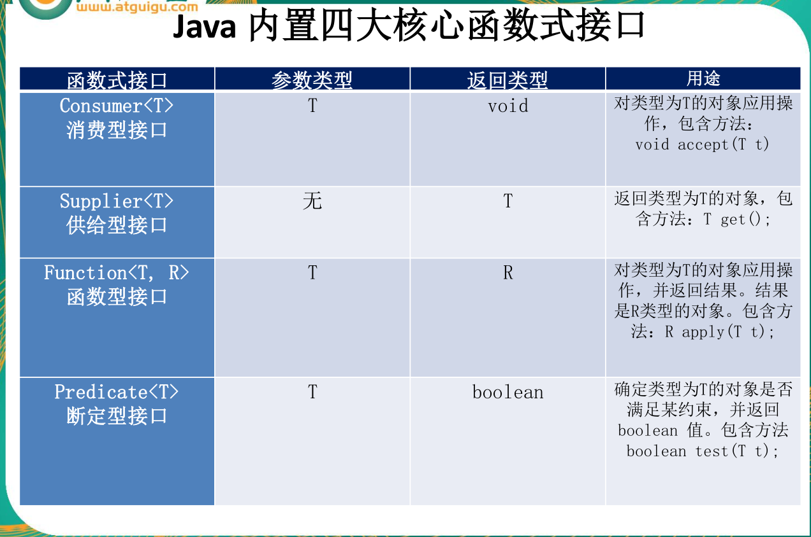

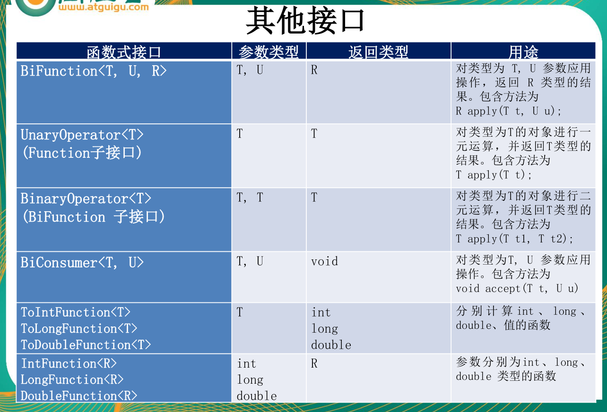

## 方法引用和构造器引用

当要传递给Lambda体的操作，已经有实现的方法了，可以使用方法引用！
（实现抽象方法的参数列表，必须与方法引用方法的参数列表保持一致！）
方法引用：使用操作符 “::” 将方法名和对象或类的名字分隔开来。
如下三种主要使用情况：

- 对象::实例方法
- 类::静态方法
- 类::实例方法

## 强大的StreamAPI

**个人理解**：一种对集合的处理链式编程方式，获取集合的stream流，进行过滤，排序呀等一系列操作

> 官方：Stream 是 Java8 中处理集合的关键抽象概念，它可以指定你希望对集合进行的操作，可以执行非常复杂的**查找、过滤和映射数据**等操作。使用Stream API 对集合数据进行操作，就类似于使用 SQL 执行的数据库查询。也可以使用 Stream API 来并行执行操作。简而言之，Stream API 提供了一种高效且易于使用的处理数据的方式。

Stream是数据渠道，用于操作数据源（集合、数组等）所生成的元素序列。
“**集合讲的是数据，流讲的是计算**！”

**注意**：

①Stream 自己不会存储元素。
②Stream 不会改变源对象。相反，他们会返回一个持有结果的新Stream。
③Stream 操作是延迟执行的。这意味着他们会等到需要结果的时候才执行。

**Stream操作的三个步骤：**

1. 创建Stream：如：list.stream()
2. 中间操作：对Stream流进行数据处理
3. 终止操作：产生结果

```java
//例子所用数据
List<User> users = Arrays.asList(
    new User(1,"张三",35,15335, User.Status.FREE),
    new User(2,"李四",30,97548, User.Status.BUSY),
    new User(3,"王五",55,3555,User.Status.VOCATION),
    new User(3,"王五",55,3555, User.Status.FREE),
    new User(4,"赵六",55,7852, User.Status.VOCATION)
);
```


```java
//eg:
//内部迭代：迭代操作有由Stream API 完成
@Test
public void test1(){
    //创建流
    Stream<User> userStream = users.stream()
        .filter(user -> {
            System.out.println("Stream 的中间操作"); //中间操作：不会执行任何操作
            return user.getAge() >= 35;

        });
    //终止操作：一次性执行全部内容，即“惰性求职”
    userStream.forEach(System.out::println);

}
```


**创建stream流的两种方式：**


default Stream<E> stream() : 返回一个顺序流

default Stream<E> parallelStream() : 返回一个并行流


由数组创建流：Java8 中的 Arrays 的静态方法 stream()

由值创建流：可以使用静态方法 Stream.of(), 通过显示值创建一个流。它可以接收任意数量的参数。

由函数创建流：创建**无限流**：可以使用静态方法 Stream.iterate() 和Stream.generate(), 创建无限流。

**stream流的中间操作：**

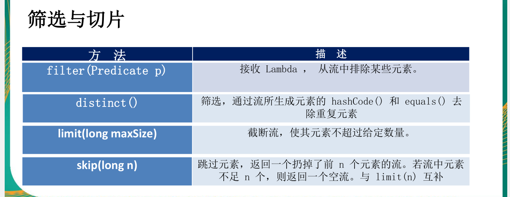

> filter(PreDicate p)：传入一个断定性接口，返回true则留下。返回false则除去
>
> distinct()：去除重复的元素，筛选， 通过流所生成的元素的hashCode() 和 equals() 去除重复元素。需要重写hashCode和equals方法

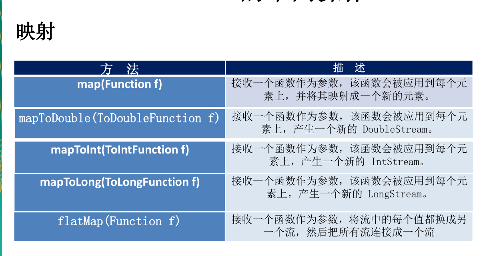

> map(Function f)：函数式接口，入参变成出参新建一个stream流
>
> 

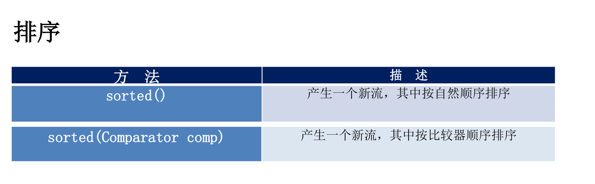

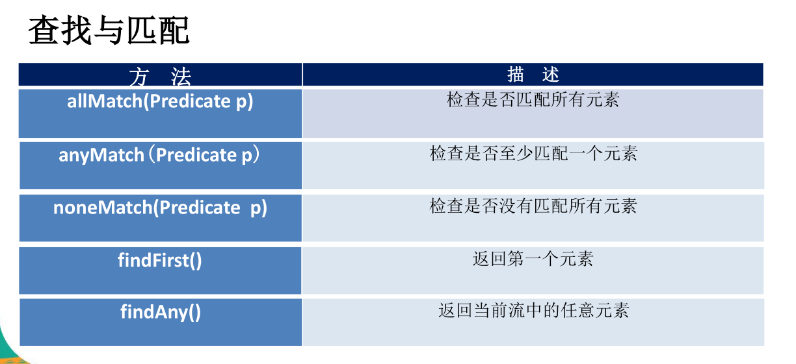

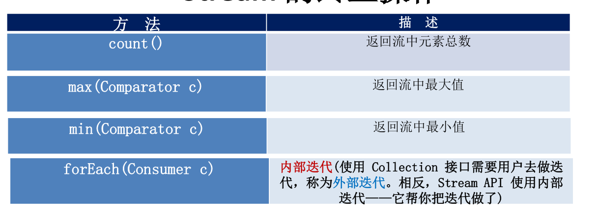

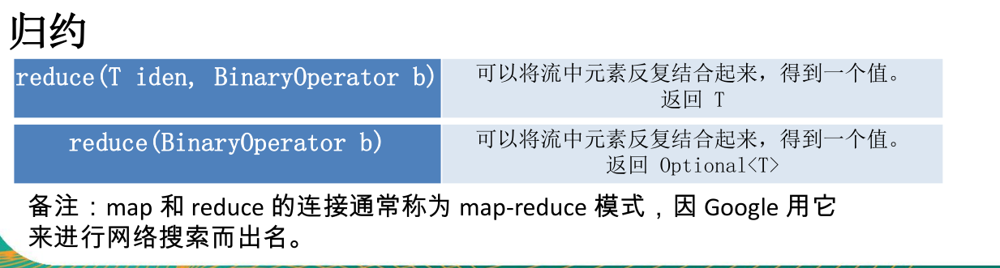

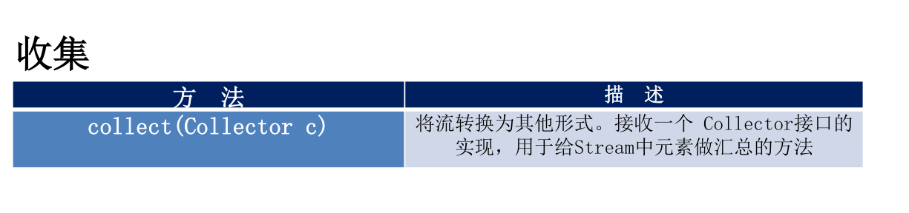

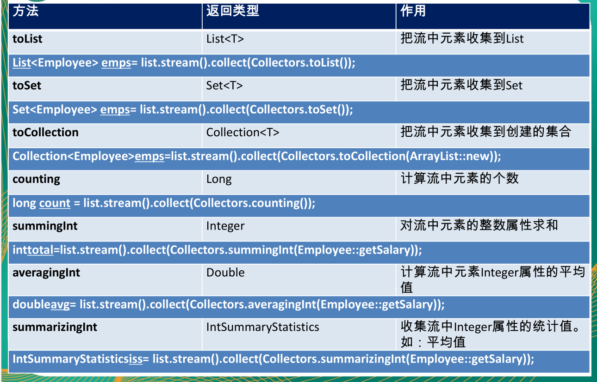

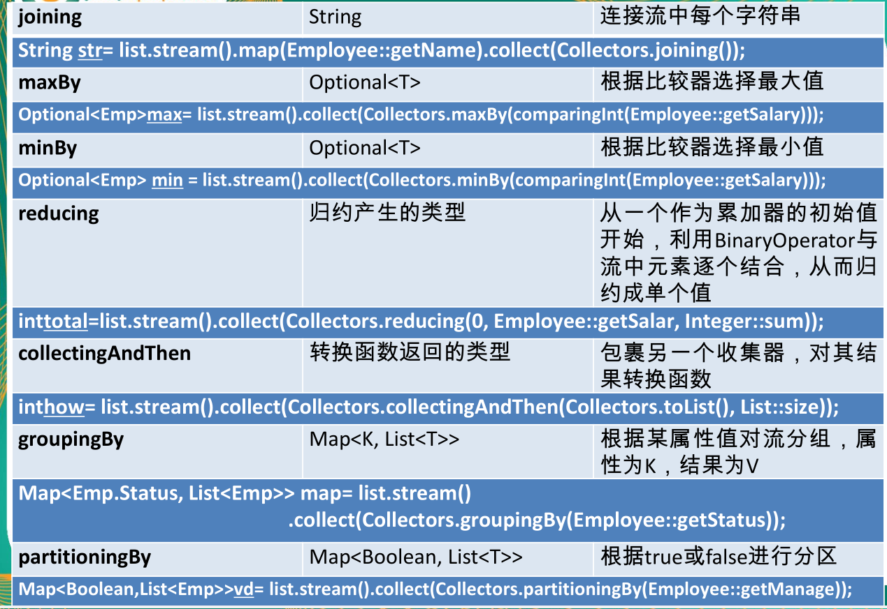


## Optional类

> Optional类（java.util.Optional）是一个容器类，代表一个值存在不存在，原来用 null 表示一个值不存在，现在Optional 可以更好的表达这个概念。 
>
> 并且可以避免空指针异常。

**常用方法：**

- Optional.of(T t) ： 创建一个 Optional 实例。**注意**：入参不能为空，否则报空指针异常
- Optional.empty() ： 创建一个空的 Optional 实例
- Optional.ofNullable(T t) ：若 t 不为 null，创建 Optional实例，否则创建空实例
- isPresent() ：判断是否包含值
- orElse(I t) ：如果调用对象包含值，返回该值，否则返回t
- orElseGet (Supplier s) ：如果调用对象包含值，返回该值，否则返回s获取的值
- map (Function f) ：如果有值对其处理，并返回处理后的Optional,否则返回Optional. empty ()
- flatMap (Function mapper) ：与map 类似，要求返回值必须是Optional


## 接口中的默认方法和静态方法

> 以前接口只能有全局静态常量和抽象方法
>
> 在java中允许拥有实现了的方法，成为默认方法，用**default**关键字修饰

**接口默认方法的类优先原则**

> 如果一个类继承了一个父类又实现了一个接口，且该父类和接口拥有相同方法名的方法，则优先使用父类的方法。
>
> **注意**：如果一个类多实现接口，且过个接口中拥有相同的默认方法，则该类必须实现默认方法，且明确是哪个接口中的。


## 新时间日期API

以前的时间日期API不是线程安全的

#### 使用LocalData，LocalTime，LocalDataTime

>  LocalDate、LocalTime、LocalDateTime 类的实 例是不可变的对象，分别表示使用 ISO-8601日 历系统的日期、时间、日期和时间。它们提供了简单的日期或时间，并不包含当前的时间信息。也不包含与时区相关的信息。

|                          方法                           |                             描述                             |
| :-----------------------------------------------------: | :----------------------------------------------------------: |
|                          now()                          |                静态方法，根据当前时间创建对象                |
|                          of()                           |             静态方法，根据指定日期/时间创建 对象             |
|     plusDays, plusWeeks, <br />plusMonths, plusYear     |      向当前 LocalDate 对象添加几天、 几周、几个月、几年      |
|  minusDays, minusWeeks, <br />minusMonths, minusYears   |      从当前 LocalDate 对象减去几天、 几周、几个月、几年      |
|                       plus, minus                       |               添加或减少一个 Duration或 Period               |
| withDayOfMonth, withDayOfYear,<br /> withMonth, withYea | 将月份天数、年份天数、月份、年 份修改为指定的值并返回新的 LocalDate对象 |
|        getDayOfMonth，getDayOfYear，getDayOfWeek        | 获得月份天数(1-31)，获得年份天数(1-366)，获得星期几(返回一个 DayOfWeek 枚举值) |
|                          until                          | 获得两个日期之间的 Period 对象， 或者指定 ChronoUnits的数字  |
|                    isBefore, isAfter                    |                      比较两个 LocalDate                      |
|                       isLeapYear                        |                        判断是否是闰年                        |

#### Instant时间戳

> 用于“时间戳”的运算。它是以Unix元年(传统 的设定为UTC时区1970年1月1日午夜时分)开始 所经历的描述进行运算

#### Duration 和 Period

-  Duration:用于计算两个“时间”间隔
-  Period:用于计算两个“日期”间隔

#### 日期的操作

- TemporalAdjuster : 时间校正器。有时我们可能需要获取

  - 例如：将日期调整到“下个周日”等操作。

- TemporalAdjusters : 该类通过静态方法提供了大量的常用 TemporalAdjuster 的实现。

  - 例如获取下个周日：

  ```java
  LocalData ld = new LocalData.now().with(TemporalAdjusters.next(DayaOfWeek.NEWX_SUNDAY));
  ```

#### 日期的格式化

java.time.format.DateTimeFormatter 类：该类提供了三种格式化方法：

```java
@Test
    public void test1(){
        DateTimeFormatter dtf = DateTimeFormatter.ofPattern("yyyy-MM-dd");
        LocalDateTime ldt = LocalDateTime.now();
        String format = ldt.format(dtf);
        System.out.println(format);
    }
```

#### 时区的处理

> ava8 中加入了对时区的支持，带时区的时间为分别为：
> 		ZonedDate、ZonedTime、ZonedDateTime
> 其中每个时区都对应着 ID，地区ID都为 “{区域}/{城市}”的格式
> 例如 ：Asia/Shanghai 等
> 			ZoneId：该类中包含了所有的时区信息
> 			getAvailableZoneIds() : 可以获取所有时区时区信息
> 			of(id) : 用指定的时区信息获取 ZoneId 对象

```java
 @Test
    public void test2(){
        Set<String> availableZoneIds = ZoneId.getAvailableZoneIds();
        availableZoneIds.forEach(System.out::println);
        System.out.println("===========================");
        ZonedDateTime of = ZonedDateTime.of(LocalDateTime.now(), ZoneId.of("Asia/Dhaka"));
        System.out.println(of);
    }
```

#### 与传统日期处理的转换

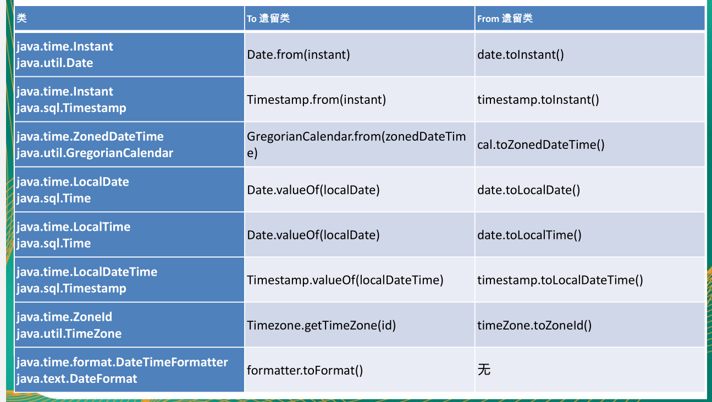