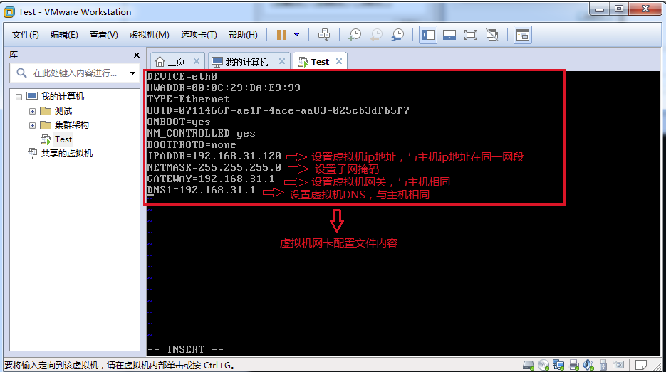
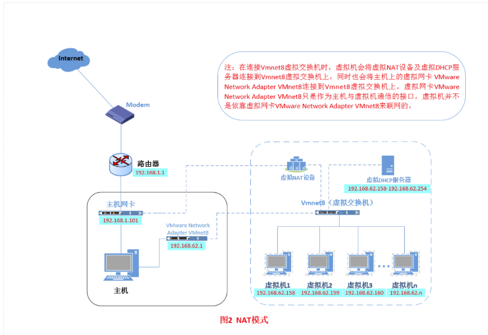
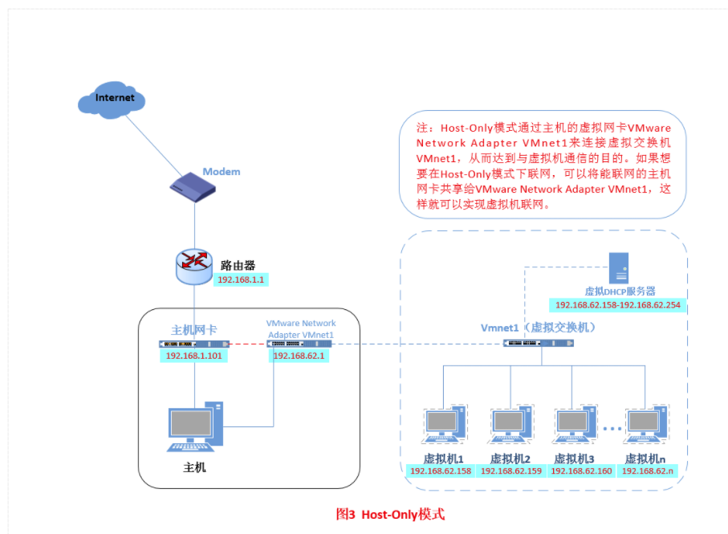

# [连接网络的三种方式](https://www.cnblogs.com/bz310/p/12006741.html)

## 一、桥接模式

**什么是桥接模式？**

桥接模式就是将主机网卡与虚拟机虚拟的网卡利用虚拟网桥进行通信。在桥接的作用下，类似于把物理主机虚拟为一个交换机，所有桥接设置的虚拟机连接到这个交换机的一个接口上，物理主机也同样插在这个交换机当中，所以所有桥接下的网卡与网卡都是交换模式的，相互可以访问而不干扰。在桥接模式下，虚拟机ip地址需要与主机在同一个网段，如果需要联网，则网关与DNS需要与主机网卡一致。其网络结构如下图所示：

### 操作

- 开启系统之前，点击“编辑虚拟机设置”来设置网卡模式。

进入系统之前，我们先确认一下主机的ip地址、网关、DNS等信息。

进入网络适配器查看自己主机的ipv4地址DNS服务器地址等信息

进入系统编辑网卡配置文件，命令为vi /etc/sysconfig/network-scripts/ifcfg-eth0（不一定为这个名字了）

编辑它

编辑完成，重启虚拟网卡`/ect/init.d/network restart`，测试是否能ping通外网

能ping通外网就桥接模式设置成功，	

## 二、NAT（地址转换连接）

如果你的网络ip资源紧缺，但是你又希望你的虚拟机能够联网，这时候NAT模式是最好的选择。NAT模式借助虚拟NAT设备和虚拟DHCP服务器，使得虚拟机可以联网。其网络结构如下图所示：

## 三、Host-Only（仅主机模式）

Host-Only模式其实就是NAT模式去除了虚拟NAT设备，然后使用VMware Network Adapter VMnet1虚拟网卡连接VMnet1虚拟交换机来与虚拟机通信的，Host-Only模式将虚拟机与外网隔开，使得虚拟机成为一个独立的系统，只与主机相互通讯。其网络结构如下图所示：

