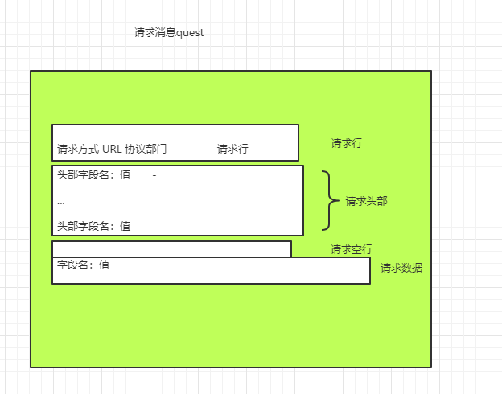
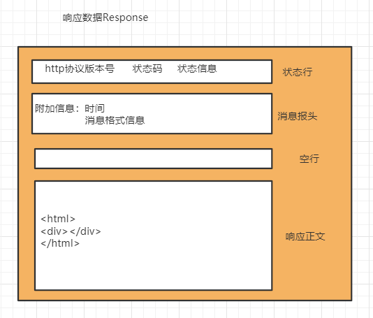
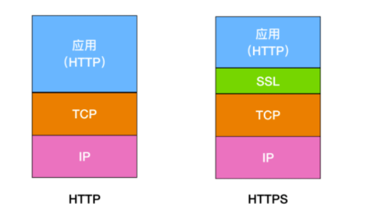

# HTTP协议

HTTP协议是**超文本传输协议**，用于从万维网服务器传输超文本到浏览器的传输协议。

它是**基于TCP/IP通信协议**来传递数据的。

HTTP协议工作于C/S（客户端/服务器）架构上。

属于**应用层**，**面向对象的**协议。

**特点：**

- 简单快速
- 灵活
- 无连接（每次只处理一个请求）
- 无状态（不保存传输的信息，**HTTP1.1版本后引入Cookie技术**）
- 支持B/S、C/S架构

**URL**

http协议使用统一资源定标识符（Uniform Resources Identifiers：URI）来传输数据和建立连接。

URL是一种特殊的URI，全称为统一资源定位符（Uniform Resources Locader）。它包含了用于查找某个资源所需要的所有信息。用于在互联网上确认某一处的资源

组成：

​	**`协议部分`\:\//`域名部分`:`端口部门`/`虚拟目录部分`/`文件名部分`?`参数部门`#`锚部分`**

eg：http://localhost:8080/admin/index.html?a=1#name


**请求消息Request**

格式：



**响应消息Response**




**HTTP状态码**

1XX：消息（没看到过哈哈哈）

2XX：成功

3XX：重定向（再来一道面试题：你知道301和302的区别吗？都是重定向哦，答案在最后）

4XX：客户端错误（检查路径，参数等）

5XX：服务端错误（打开命令窗口查看错误）


**HTTP工作原理**

1. 客户端连接到Web服务器（先会通过DNS解析 域名找到服务端的ip地址咯，绕后通过TCP三次握手建立连接，这个我写过）
2. 发送http请求
3. 服务端接受请求并返回http响应
4. 释放TCP连接
5. 客户端浏览器解析响应正文展示到浏览器窗口


# Http与https的区别

Https比http多了secure（安全）性这个概念，实际上，Https并不是一个全新的应用层协议，它其实就是HTTP+TSL/SSL协议组合而成的，而安全性的保证正是TLS/SSL 所做的工作

**HTTPS 就是身披了一层 SSL 的 HTTP**。



- 最简单的，HTTP在地址栏以http://开头，而https是以https://开头
- Http 是未经安全加密的协议，它的传输过程中容易被攻击者监听、数据容易被盗取，发送方和接收方容易被伪造；而https是安全的协议，它通过**秘钥交换算法-签名算法-对称加密算法-摘要算法** 能够解决这些问题
- HTTP的默认端口是80，HTTPS的默认端口是443


# HTTP的GET和POST的区别

HTTP 中包括许多方法，**Get 和 Post 是 HTTP 中最常用的两个方法**，基本上使用 HTTP 方法中有 99% 都是在使用 Get 方法和 Post 方法，所以有必要我们对这两个方法有更加深刻的认识。

- get 方法一般用于请求，比如你在浏览器地址栏输入 www.cxuanblog.com 其实就是发送了一个 get 请求，它的主要特征是请求服务器返回资源，而 post 方法一般用于

  表单的提交，相当于是把信息提交给服务器，等待服务器作出响应，get 相当于一个是 pull/拉的操作，而 post 相当于是一个 push/推的操作。

- get 方法是不安全的，因为你在发送请求的过程中，你的请求参数会拼在 URL 后面，从而导致容易被攻击者窃取，对你的信息造成破坏和伪造；

```
/test/demo_form.asp?name1=value1&name2=value2
```

而 post 方法是把参数放在请求体 body 中的，这对用户来说不可见。

```
POST /test/demo_form.asp HTTP/1.1
Host: w3schools.com
name1=value1&name2=value2
```

- get 请求的 URL 有长度限制，而 post 请求会把参数和值放在消息体中，对数据长度没有要求。
- get 请求会被浏览器主动 cache，而 post 不会，除非手动设置。
- get 请求在浏览器反复的 回退/前进 操作是无害的，而 post 操作会再次提交表单请求。
- get 请求在发送过程中会产生一个 TCP 数据包；post 在发送过程中会产生两个 TCP 数据包。对于 get 方式的请求，浏览器会把 http header 和 data 一并发送出去，服务器响应 200（返回数据）；而对于 post，浏览器先发送 header，服务器响应 100 continue，浏览器再发送 data，服务器响应 200 ok（返回数据）。


