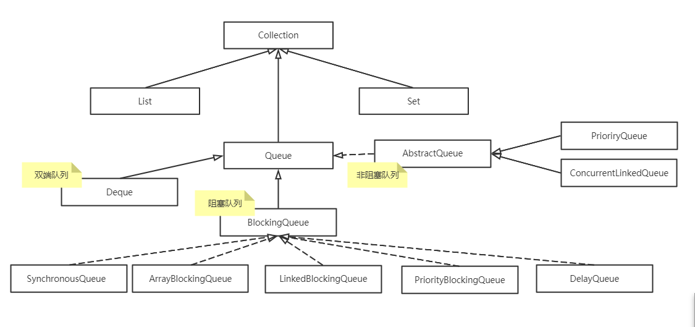

# JAVA-队列（Queue）
 Queue：基本上，一个队列就是一个先进先出（FIFO）的数据结构
 Queue继承了Collection接口，是和List，Set同级别的

 ## Queue的实现
 ### 没有实现阻塞接口（非阻塞） 实现了java.util.Queue接口和java.util.AbstractQueue接口
- 内置的不阻塞队列：**PriorityQueue** 和 **ConcurrentLinkedQueue**
  - 
### 实现了阻塞接口的 (BloclingQueue)
- ArrayBlockingQueue ：一个由数组支持的有界队列。
- LinkedBlockingQueue ：一个由链接节点支持的可选有界队列。
- PriorityBlockingQueue ：一个由优先级堆支持的无界优先级队列。
- DelayQueue ：一个由优先级堆支持的、基于时间的调度队列。
- SynchronousQueue ：一个利用 BlockingQueue 接口的简单聚集（rendezvous）机制。
### 双端队列（Deque）

注意：阻塞和分阻塞的就是在部分方法是否有锁（如：offer(T E)）


 

 ## 队列的一些操作：
| 方法名  | 功能                                            | 失败情况                   |
| ------- | ----------------------------------------------- | -------------------------- |
| add     | 往队列里新增一个元素                            | IIIegaISlabEepeplian异常   |
| remove  | 移出队列头部的元素（返回头部元素并删除）        | NoSuchElementException异常 |
| element | 返回队列头部的元素（不删除操作）                | NoSuchElementException异常 |
| offer   | 往队列里新增一个元素并返回true（已满返回false） | 返回false                  |
| poll    | 移出队列头部的元素（返回头部元素并删除）        | 返回null                   |
| peek    | 返回队列头部的元素（不删除操作）                | 返回null                   |
| put     | 往队列里新增一个元素                            | 阻塞                       |
| take    | 移出队列头部的元素（返回头部元素并删除）        | 阻塞                       |
**remove、element、offer 、poll、peek 属于Queue接口。 **

阻塞队列的操作可以根据它们的响应方式分为以下三类：aad、removee和element操作在你试图为一个已满的队列增加元素或从空队列取得元素时 抛出异常。在多线程程序中，队列在任何时间都可能变成满的或空的， 一般使用offer、poll、peek方法（因为它不会抛出异常）。
注意：队列中插入null值是不合法
最后，我们有阻塞操作put和take。put方法在队列满时阻塞，take方法在队列空时阻塞。


- LinkedBlockingQueue在不指定时容量时它的长度为Integer.MAX_VALUE，，但是也可以选择指定其最大容量，它是基于链表的队列，此队列按 FIFO（先进先出）排序元素
- ArrayBlockingQueue在构造时需要指定容量， 并可以选择是否需要公平性，如果公平参数被设置true，等待时间最长的线程会优先得到处理（其实就是通过将ReentrantLock设置为true来 达到这种公平性的：即等待时间最长的线程会先操作）。通常，公平性会使你在性能上付出代价，只有在的确非常需要的时候再使用它。它是基于数组的阻塞循环队 列，此队列按 FIFO（先进先出）原则对元素进行排序。
- PriorityBlockingQueue是一个带优先级的队列，而不是先进先出队列。元素按优先级顺序被移除，该队列也没有上限（看了一下源码，PriorityBlockingQueue是对 PriorityQueue的再次包装，是基于堆数据结构的，而PriorityQueue是没有容量限制的，与ArrayList一样，所以在优先阻塞 队列上put时是不会受阻的。虽然此队列逻辑上是无界的，但是由于资源被耗尽，所以试图执行添加操作可能会导致 OutOfMemoryError），但是如果队列为空，那么取元素的操作take就会阻塞，所以它的检索操作take是受阻的。另外，往入该队列中的元 素要具有比较能力。
- DelayQueue（基于PriorityQueue来实现的）是一个存放Delayed 元素的无界阻塞队列，只有在延迟期满时才能从中提取元素。该队列的头部是延迟期满后保存时间最长的 Delayed 元素。如果延迟都还没有期满，则队列没有头部，并且poll将返回null。当一个元素的 getDelay(TimeUnit.NANOSECONDS) 方法返回一个小于或等于零的值时，则出现期满，poll就以移除这个元素了。此队列不允许使用 null 元素。


**队列 ：queue**

```tex
先进先出

.add(E e)：将指定元素插入此队列中（尾插）

.element：查看这个队列的头，但是不删除

.peek：检索但不删除此队列的头，如果队列为空返回null

.poll：检索并删除此队列的头

.offer(E e)：不违反容量限制下，将指定的元素插入此队列中（尾插）

.remove：删除此队列的头	

.tack：取出并删除队头的元素,当队列为空,则会一直等待直到队列有新元素可以取出,或者线程被中断抛出异常

.put：往队列里插入元素,如果队列已经满,则会一直等待直到队列为空插入新元素,或者线程被中断抛出异常. 

注意： 队列不能直接new Queue()出来，类似于List有其子类。如LinkedBlockingQueue<E>(QUEUE_LENGTH);和ArrayBlockingQueue<E>(QUEUE_LENGTH)：其中E指泛型，QUEUE_LENGTH可以指定容量即长度**前者是以数组的形式存储，后者是以Node节点的链表形式存储。**
```


