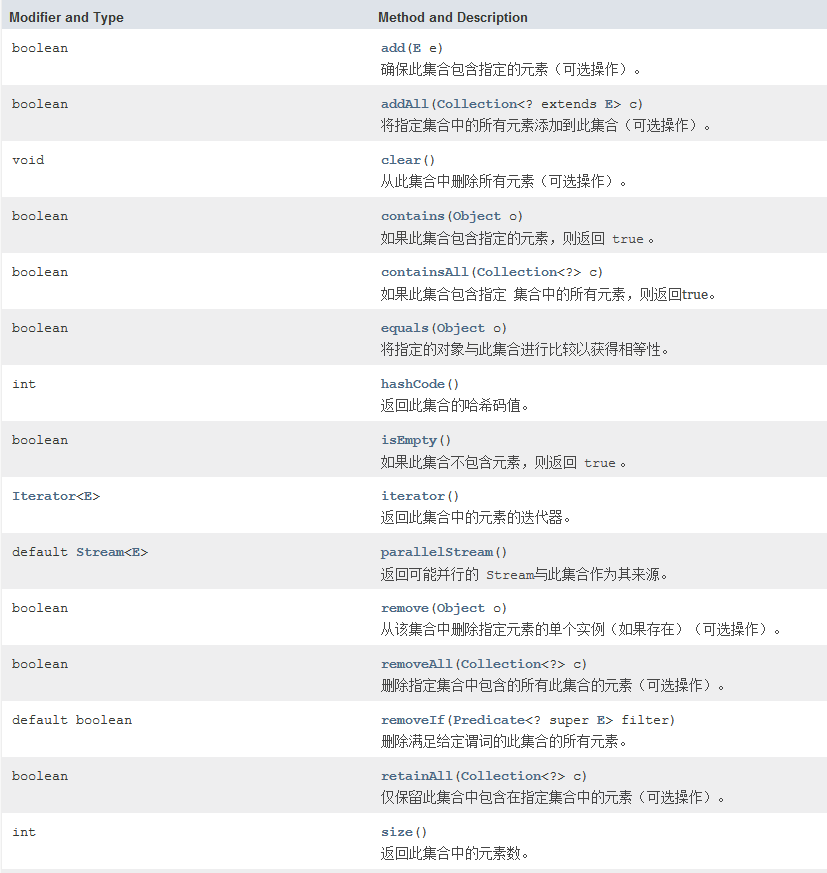
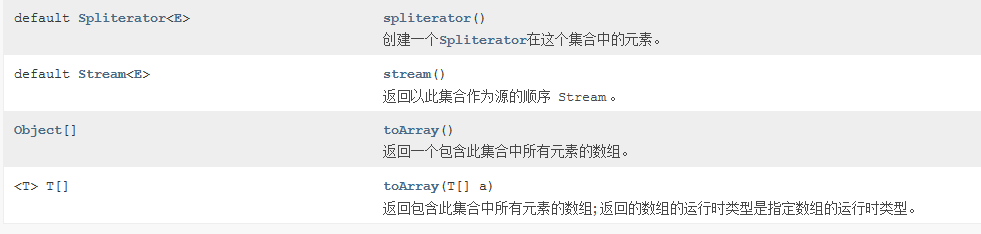

# Collection （所有集合类的接口）

List和Set都继承它，操作集合的方法大部分在该接口中定义了





# Collections （操作集合的工具类）

## 常用方法

**排序**

> void reverse(List list)	//反转
>
> void shuffle(List list)     //随机排序
>
> void sort(List list)			//按自然排序升序排列
>
> void sort(List list, Comparator c)			//定制排序，由Comparator控制排序逻辑
>
> void swap(List list, int i, int j)					//交换两个索引位置的元素
>
> void rotate(List list, int distance)				//旋转。当distance为正数时，将list后distance个元素整体移到前面。当distance为负数时，将 list的前distance个元素整体移到后面。


# Collections工具类和Arrays工具类的常用方法

## Collections

### 排序操作

```java
void reverse(List list)//反转			就是倒过来
void shuffle(List list)//随机排序
void sort(List list)//按自然排序的升序排序
void sort(List list, Comparator c)//定制排序，由Comparator控制排序逻辑		
void swap(List list, int i , int j)//交换两个索引位置的元素
void rotate(List list, int distance)//旋转。当distance为正数时，将list后distance个元素整体移到前面。当distance为负数时，将 list的前distance个元素整体移到后面。
```

### 查找替换操作

```java
//对List进行二分查找，返回索引，注意List必须是有序的
int binarySearch(List list, Object key)
//根据元素的自然顺序，返回最大的元素。 类比int min(Collection coll)
int max(Collection coll)
//根据定制排序，返回最大元素，排序规则由Comparatator类控制。类比int min(Collection coll, Comparator c)
int max(Collection coll, Comparator c)
//用指定的元素代替指定list中的所有元素。
void fill(List list, Object obj)
//统计元素出现次数
int frequency(Collection c, Object o)
//统计target在list中第一次出现的索引，找不到则返回-1，类比int lastIndexOfSubList(List source, list target).
int indexOfSubList(List list, List target)
//用新元素替换旧元素
boolean replaceAll(List list, Object oldVal, Object newVal)
```

### 同步控制

Collections提供了多个`synchronizedXxx()`方法·，该方法可以将指定集合包装成线程同步的集合，从而解决多线程并发访问集合时的线程安全问题。

我们知道 HashSet，TreeSet，ArrayList,LinkedList,HashMap,TreeMap 都是线程不安全的。Collections提供了多个静态方法可以把他们包装成线程同步的集合。

**最好不要用下面这些方法，效率非常低，需要线程安全的集合类型时请考虑使用 JUC 包下的并发集合。**

```java
synchronizedCollection(Collection<T>  c) //返回指定 collection 支持的同步（线程安全的）
collection.synchronizedList(List<T> list)//返回指定列表支持的同步（线程安全的）
List.synchronizedMap(Map<K,V> m) //返回由指定映射支持的同步（线程安全的）
Map/synchronizedSet(Set<T> s) //返回指定 set 支持的同步（线程安全的）set。
```

## Arrays类的常见操作

1. 排序 : `sort()`
2. 查找 : `binarySearch()`
3. 比较: `equals()`
4. 填充 : `fill()`
5. 转列表: `asList()`
6. 转字符串 : `toString()`
7. 复制: `copyOf()`


