 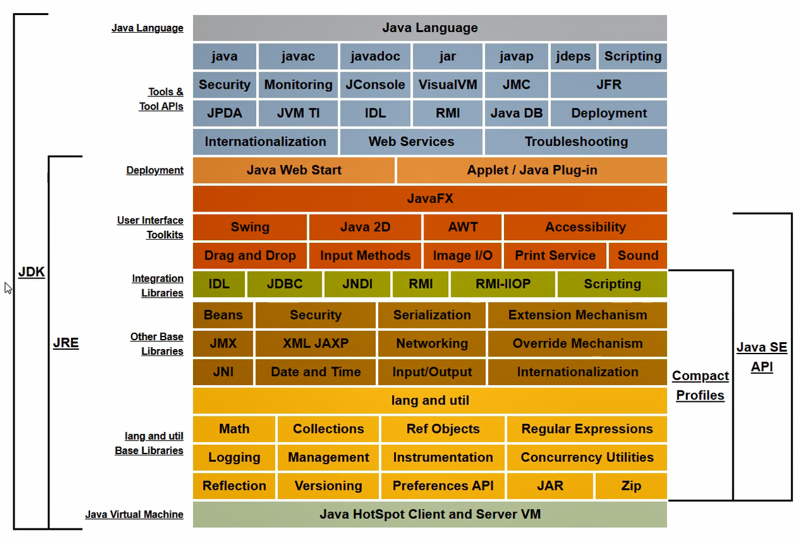

# JVM理解

- 它能够让class文件跑一跑

- 屏蔽不同操作系统的CPU指令集	**跨平台**

> Person.java ---> javac Person.java ---> Person.class
>
> Java Virtual Machine(JVM)是包含在我们下载的JDK中的，对应不同的操作系统我们下载不一样的JDK，其实就下载了不同的JVM，而对应不用操作系统的JVM会将class文件解释成与操作系统相对应的机器语言，从而实现了JAVA语言的**Write Once，Run Anywhere**的特性。

**常量池中存储的内容：**	字面量和符号引用

- 字面量：文本字符串和final修饰的内容

- 符号引用：类、接口、字端、方法修饰符  ----->  元数据

## 装载、链接和初始化

所谓的类加载机制就是：虚拟机将class文件加载到内存，并对数据进行校验、转换解析和初始化，形成虚拟机可以直接使用的class类型

### 装载

> 1、找到class文件到底在哪里   （内存|磁盘|网络|数据库）
>
> 2、class的字节流信息    ------>  存储在JVM的某一块【运行时数据区的方法区】
>
> 3、class文件的对象 Class Clazz代表   ------> 【运行时数据区的堆】

### 链接

> 1、验证
>
> > 文件格式、元数据、字节码、符号引用
>
> 2、准备
>
> > 为类的静态变量分配内存，并且将其进行初始化默认值
> >
> >​	public static int a = 10;  		**这里只复制分配内存，a = 0 ，0是int类型的默认值**
>
> 3、解析
>
> > 将符号引用转变成直接引用
> >
> > 符号引用：只是符号，JVM能够认识，但是没有实际含义（不在物理机上占用内存）
> >
> > 直接引用：落实了物理地址

## 初始化

给之前的静态变量赋予实际的值

a=10;

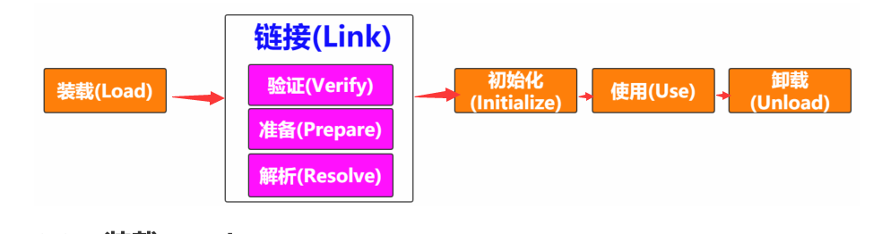

## 类加载器	ClassLoader

在装载（Load）阶段，第一步就是通过类的全限定类名获取其定义的二进制字节流，需要借助类装载器完成，顾名示意就是用来装载Class文件的

> 类加载器分类：
>
> 1）Bootstrap ClassLoader 负责加载$JAVA_HOME中 jre/lib/rt.jar 里所有的class或Xbootclasspath选项指定的jar包。由C++实现，不是ClassLoader子类。
> 2）Extension ClassLoader 负责加载java平台中扩展功能的一些jar包，包括$JAVA_HOME中jre/lib/*.jar 或 -Djava.ext.dirs指定目录下的jar包。
> 3）App ClassLoader 负责加载classpath中指定的jar包及 Djava.class.path 所指定目录下的类和jar包。
> 4）Custom ClassLoader 通过java.lang.ClassLoader的子类自定义加载class，属于应用程序根据自身需要自定义的ClassLoader，如tomcat、jboss都会根据j2ee规范自行实现ClassLoader。

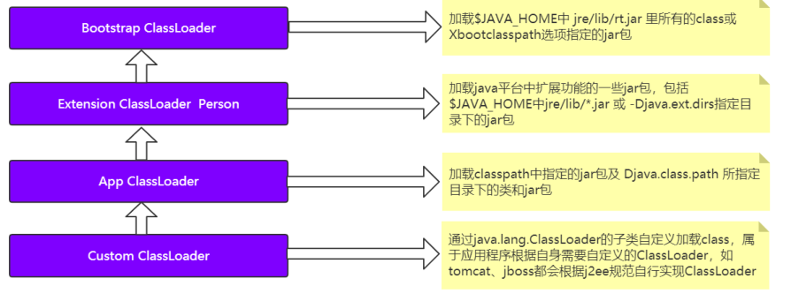

### 加载原则（双亲委派原则）

检查某个类是否已经加载，自底向上从Custom ClassLoader向上逐步检查到BootStrap ClassLoader，只要某个Classloder已加载，就视为已加载此类，保证此类只被加载一次

# JVM结构即他们的作用

## 运行时数据区

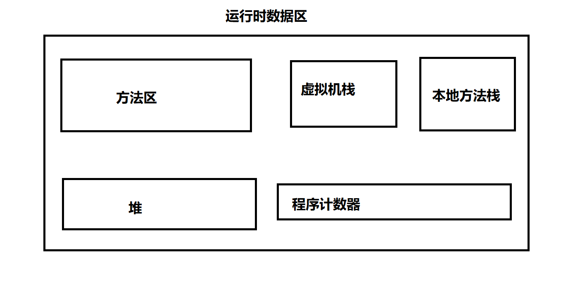

- **方法区（Method Area）：**用来存储类的信息、常量、方法等元数据信息。（class Info）
- **堆（Heap）：**用来存储实例对象（new 对象）
- **虚拟机栈（Java Virtual Machine Stacks）：**每一个java进程都会新建一个虚拟机栈和本地方法栈。虚拟机栈是一个栈的结构（FILO），执行方法。
- **本机方法栈（Native Method Stacks）：**如果调用了native方法，则该方法不能压入虚拟机栈，而是压在本地方法栈，调用之间用一个动态链接来保证关系。
- **程序计数器（The pc Register）：**用来保证程序的正确执行，比如当一个进程的CPU时间片用完了，此时程序计数器就就会记录当前程序执行的位置，该进程继续运行时就会借此恢复失去时间片时的运行状态。

> 方法区和堆是所有线程共享的，虚拟机栈、本地方法栈和程序计数器是每个线程都有一份，由此可以得出，方法区和堆是非线程安全的，虚拟机栈、本地方法栈和程序计数器是线程安全的

## Frame（栈帧）

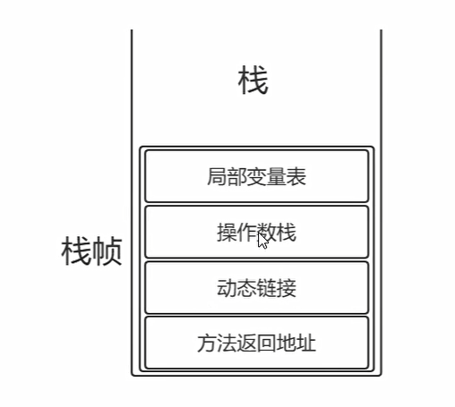

定义：**每个栈帧对应一个被调用的方法，可以理解为一个方法的运行空间**

每个栈帧中都包含了局部变量表、操作数栈、动态链接、方法返回地址

> 局部变量表：方法中存储局部变量的表，底层是一个数组
>
> 操作数栈：以压栈和出栈的方式来存储操作数
>
> 动态链接：再次将符号引用转变为直接引用，主要是为了解决方法中的重写（多态）
>
> 方法返回地址：调用完方法后，回到调用处

## java对象内存模型

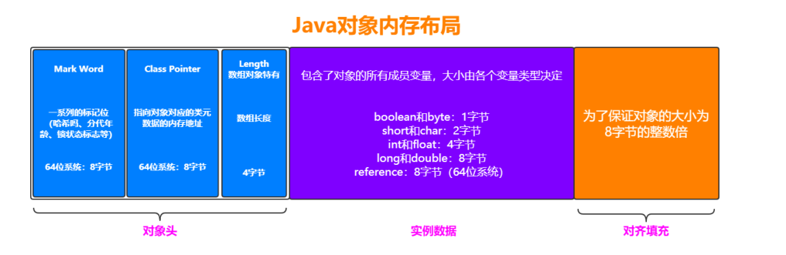

一个java对象在内存中包括三个部分：内存头、实例数据、对齐填充

# JVM内存模型

JVM内存模型主要从**方法区（非堆）和堆这两方面**说明，因为对于虚拟机栈，本地方法栈，程序计数器都是线程私有的。

**运行时数据区是一种规范，是逻辑上的，而JVM内存模式是对该规范的实现。**

## 图形展示

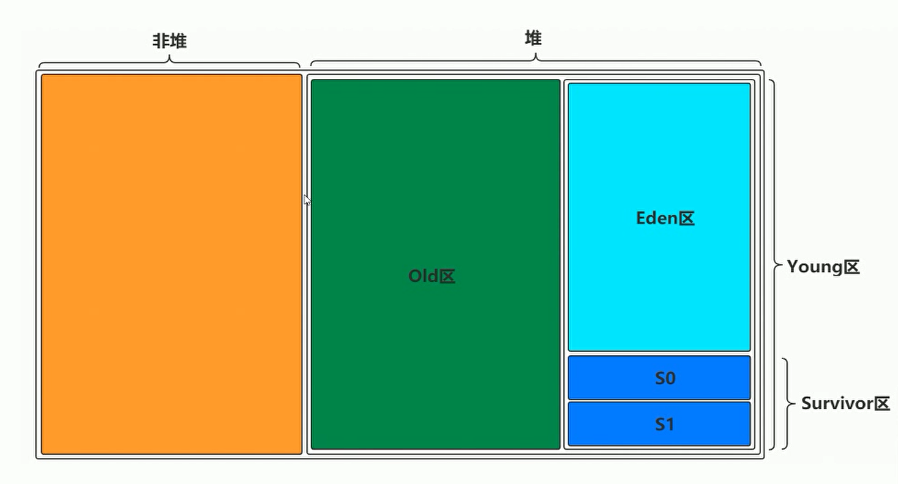

> 一块是非堆区(方法区)，一块是堆区
> 堆区分为两大块，一个是Old区，一个是Young区
> Young区分为两大块，一个是Survivor区（S0+S1），一块是Eden区
> S0和S1一样大，也可以叫From和To

## 对象的创建

新对象产生时会放在Eden去，如果Eden区空间不足，触发MinorGC回收Eden区垃圾对象，然后将新对象放入Eden区，如果还不足的话判断survivor区是否有足够的空间，有的话将Edenn去幸存对象复制到survivor区，将新对象放入Eden区，如果survivor依旧不足的话判断old区空间，若充足则将survivor区部分活跃对象复制到Old区，Eden区对象复制到survivor区，新对象放入Eden区，若依旧不足触发fullGC，再判断old区空间是否足够，足够与上一样，不足着出现OOM

> 新对象的产生会产生在Eden区，当达到某个临界值（一般是Eden区的一半）时触发GC，未被回收的对象符复制到S0或者S1区，清空Eden区，当Eden区再一次触发GC时，将S0或者S1区未被回收的对象以及Eden区未被回收的对象复制到另外一个Surbovor区（S0和S1必然有一个为空，这是牺牲空间换连续地址），当age大于old时（默认是15）时该对象会被移至old区。，如果old区依旧不足会触发MajorGC，MajorGC一般会触发MinorGC，相当于FullGC，FullGC之后空间还是不足不有OOM异常产生**注意：**一些较大的对象会被直接放入old区

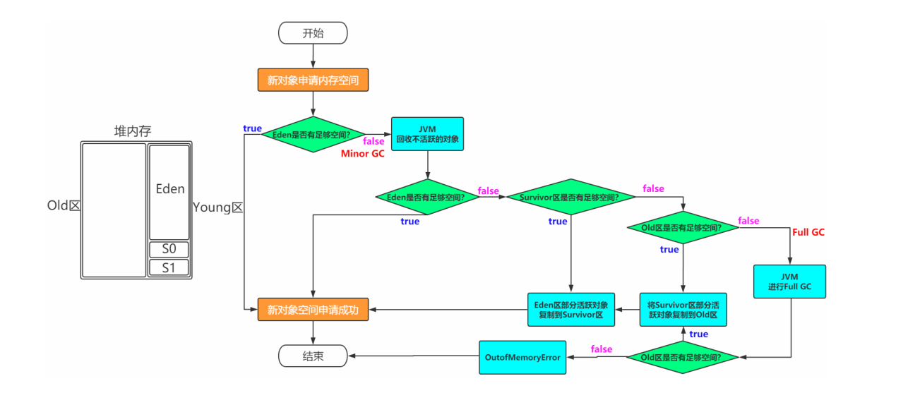

> 其他细节：
>
> - 新生代比老年代默认比例：1:2（新生代占对空间的三分之一，老年代占三分之二）
> - young区：   Eden区：S1：S2  =  8:1:1
> - 担保机制：如果大对象在一个Survivor区放不下，会在Old区借内存来存储，这就是担保机制（**担保机制中survivor所借的空间GC时采用Old区的GC方法**）

工具：jvisualvm：可以看到各区的内存情况（下面还有介绍）

> 常见问题解答：
>
> - **为什么需要Survivor区?只有Eden不行吗？**
>
>   如果没有Survivor,Eden区每进行一次Minor GC,存活的对象就会被送到老年代。
>   这样一来，老年代很快被填满,触发Major GC(因为Major GC一般伴随着Minor GC,也可以看做触发了
>   Full GC)。
>   老年代的内存空间远大于新生代,进行一次Full GC消耗的时间比Minor GC长得多。
>   执行时间长有什么坏处?频发的Full GC消耗的时间很长,会影响大型程序的执行和响应速度。
>   可能你会说，那就对老年代的空间进行增加或者较少咯。
>   假如增加老年代空间，更多存活对象才能填满老年代。虽然降低Full GC频率，但是随着老年代空间加大,一
>   旦发生Full GC,执行所需要的时间更长。
>   假如减少老年代空间，虽然Full GC所需时间减少，但是老年代很快被存活对象填满,Full GC频率增加。
>   **所以Survivor的存在意义,就是减少被送到老年代的对象,进而减少Full GC的发生,Survivor的预筛选保
>   证,只有经历16次Minor GC还能在新生代中存活的对象,才会被送到老年代。**
>
> - **为什么需要两个Survivor区？**
>
>   最大的好处就是解决了碎片化。也就是说为什么一个Survivor区不行?第一部分中,我们知道了必须设置
>   Survivor区。假设现在只有一个Survivor区,我们来模拟一下流程:
>   刚刚新建的对象在Eden中,一旦Eden满了,触发一次Minor GC,Eden中的存活对象就会被移动到Survivor
>   区。这样继续循环下去,下一次Eden满了的时候,问题来了,此时进行Minor GC,Eden和Survivor各有一些
>   存活对象,如果此时把Eden区的存活对象硬放到Survivor区,很明显这两部分对象所占有的内存是不连续的,
>   也就导致了内存碎片化。
>   永远有一个Survivor space是空的,另一个非空的Survivor space无碎片。
>
> - **新生代中Eden:S1:S2为什么是8:1:1？**
>
>   新生代中的可用内存：复制算法用来担保的内存为9:1
>   可用内存中Eden：S1区为8:1
>   即新生代中Eden:S1:S2 = 8:1:1
>   现代的商业虚拟机都采用这种收集算法来回收新生代，IBM公司的专门研究表明，新生代中的对象大概98%是
>   “朝生夕死”的
>
>   （这个比例不是固定的，JVM底层有对它的优化）
>
> - **堆内存中都是线程共享的区域吗？**
>
>   JVM默认为每个线程在Eden上开辟一个buffer区域，用来加速对象的分配，称之为TLAB，全称:Thread
>   Local Allocation Buffer。
>   对象优先会在TLAB上分配，但是TLAB空间通常会比较小，如果对象比较大，那么还是在共享区域分配。

# 垃圾回收机制

> Mimor GC：young区的GC，新生代
>
> Major GC：old区的GC，老年代
>
> Full GC：old区+young区：新生代和老年代

## 判断一个对象是否是垃圾

- **引用计数法**

  对于某个对象而言，只要应用程序中持有该对象的引用，就说明该对象不是垃圾，如果一个对象没有任
  何指针对其引用，它就是垃圾。
  **弊端 :**如果AB相互持有引用，导致永远不能被回收。（A引用B，B引用A，而没有其他任何对象引用A或B）

- **可达性分析**

  通过GC Root的对象，开始向下寻找，看某个对象是否可达

  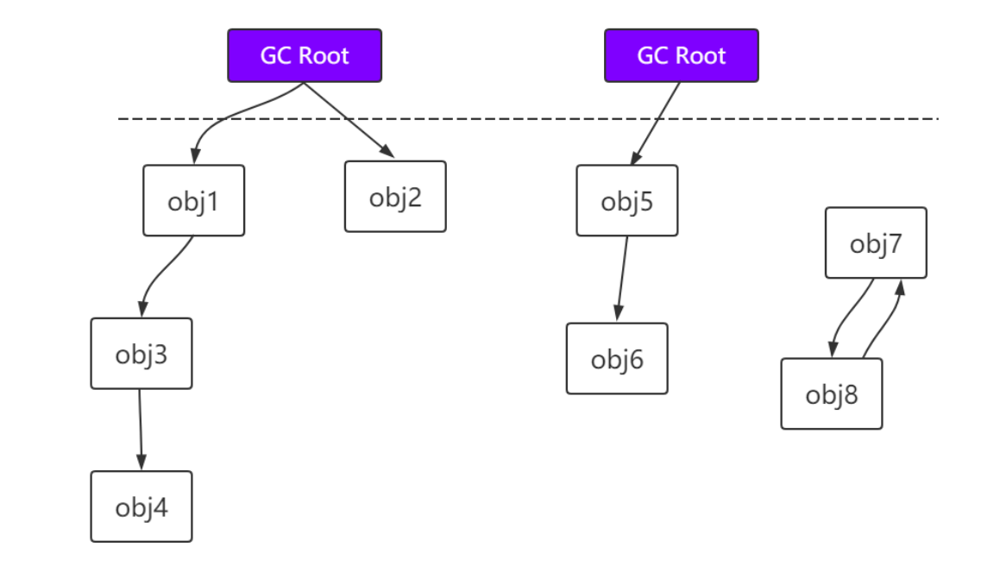

> 能作为GC Root:类加载器、Thread、虚拟机栈的本地变量表、static成员、常量引用、本地方法栈的变量等
>
> （就是能作为上帝视角的对象）
>
> 虚拟机栈（栈帧中的本地变量表）中引用的对象。
> 方法区中类静态属性引用的对象。
> 方法区中常量引用的对象。
> 本地方法栈中JNI（即一般说的Native方法）引用的对象。

## 什么时候回收垃圾？

GC是由JVM自动完成的，根据JVM系统环境而定，所以时机是不确定的。
当然，我们可以手动进行垃圾回收，比如调用System.gc()方法通知JVM进行一次垃圾回收，但是具体什么时刻运行也无法控制。也就是说System.gc()只是通知要回收，什么时候回收由JVM决定。但是不建议手动调用该方法，因为GC消耗的资源比较大。

> 手动调用System.gc();
>
> 老年代空间不够用了
>
> 新生代空间不够用了
>
> 方法区空间不不够用了

## 垃圾回收算法

### 标记-清除算法（最简单却最浪费时间）CMS用

- 标记：找出内存中需要清除的对象，并进行标记

> 此时堆中所有的对象都会扫描一次，从而确定需要清除的对象，比较耗时

- 清除：清除掉需要回收对象，释放出对应的空间

> 又要扫描一次

**缺点：**

1. 标记和清除两个过程都比较耗时，效率不高
2. 会产生大量不连续的内存碎片，空间碎片太多可能会导致以后在程序运行过程中需要分配较大对象时，无
   法找到足够的连续内存而不得不提前触发另一次垃圾收集动作。

### 标记-复制算法：（浪费一半内存，增加效率）新生代常用

将内存平分为两块空间，标记和上面一样，然后复制为标记对象至留白的空间（连续的存储），然后把原空间的所有对象一次全部清除

**缺点：**

1. 空间利用率低

### 标记-整理算法：（实现很复杂）老年代常用

> 复制收集算法在对象存活率较高时就要进行较多的复制操作，效率将会变低。更关键的是，**如果
> 不想浪费50%的空间，就需要有额外的空间进行分配担保，以应对被使用的内存中所有对象都有
> 100%存活的极端情况，所以老年代一般不能直接选用这种算法。**

标记过程仍然与"标记-清除"算法一样，但是后续步骤不是直接对可回收对象进行清理，而是让所有存活
的对象都向一端移动，然后直接清理掉端边界以外的内存。

> 其实上述过程相对"复制算法"来讲，少了一个"保留区"

**ps：（不同区对垃圾回收算法的选择）**

- Young区：复制算法(对象在被分配之后，可能生命周期比较短，Young区复制效率比较高
- Old区：标记清除或标记整理(Old区对象存活时间比较长，复制来复制去没必要，不如做个标记再清理)

## 垃圾收集器

如果说收集算法是内存回收的方法论，那么垃圾收集器就是内存回收的具体实现。

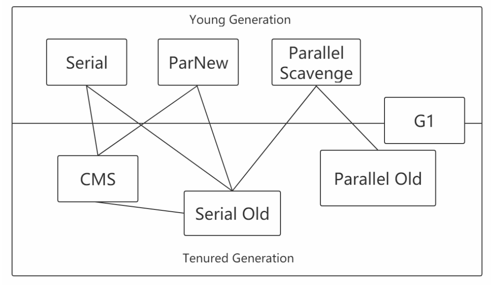

### Serial

Serial收集器是最基本、发展历史最悠久的收集器，曾经（在JDK1.3.1之前）是虚拟机新生代收集的唯一选择。
它是一种**单线程收集器**，不仅仅意味着它只会使用一个CPU或者一条收集线程去完成垃圾收集工作，更重要的是其在**进行垃圾收集的时候需要暂停其他线程。**

> **优点：**简单高效，拥有很高的单线程收集效率
> **缺点：**收集过程需要暂停所有线程
> **算法：**标记-复制算法
> **适用范围：**新生代
> **应用：**Client模式下的默认新生代收集器

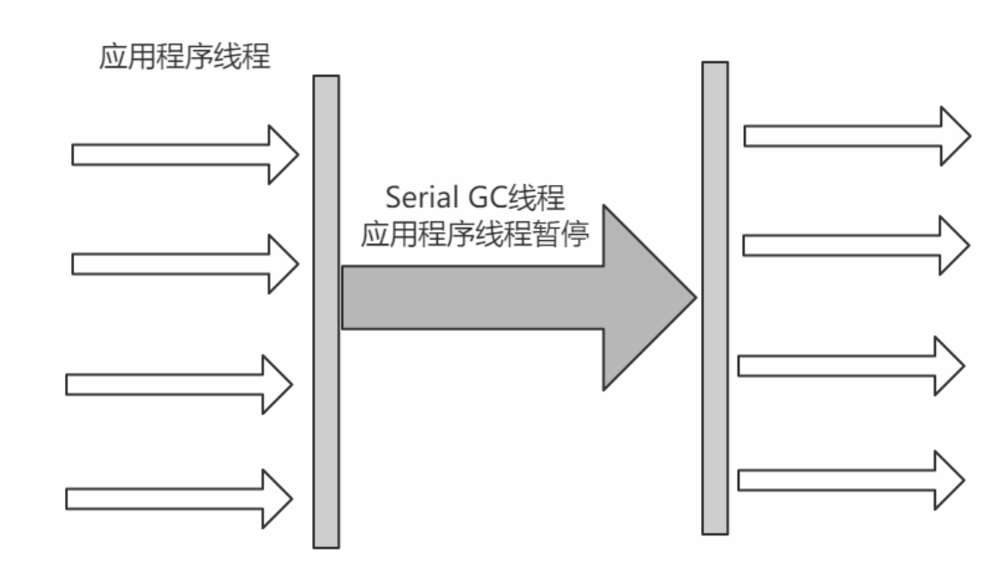

### Serial Old

Serial Old收集器是Serial收集器的老年代版本，也是一个单线程收集器，不同的是采用"标记-整理算法"，运行过程和Serial收集器一样。

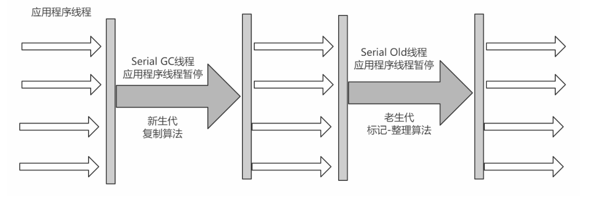

### ParNew

可以把这个收集器理解为Serial收集器的多线程版本。

> **优点：**在多CPU时，比Serial效率高。
> **缺点：**收集过程暂停所有应用程序线程，单CPU时比Serial效率差。
> **算法：**复制算法
> **适用范围：**新生代
> **应用：**运行在Server模式下的虚拟机中首选的新生代收集器

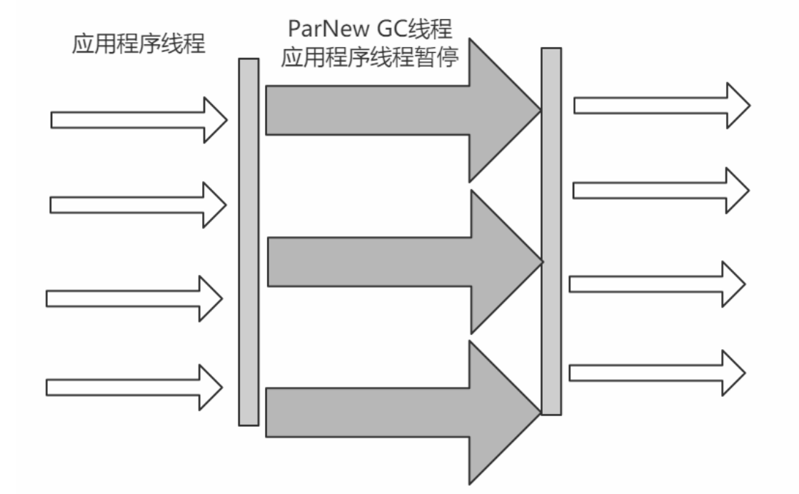

### Parallel Scavenge（相对ParNew来说它的吞吐量更大）

Parallel Scavenge收集器是一个新生代收集器，它也是使用复制算法的收集器，又是并行的多线程收集
器，看上去和ParNew一样，但是**Parallel Scanvenge更关注系统的吞吐量。**

> JVM参数：
>
> -XX:MaxGCPauseMillis控制最大的垃圾收集停顿时间，
> -XX:GCRatio直接设置吞吐量的大小。

### Parallel Old

Parallel Old收集器是Parallel Scavenge收集器的老年代版本，使用多线程和标记-整理算法进行垃圾回
收，也是更加关注系统的吞吐量。

###  CMS（适用于老年代）

CMS(Concurrent Mark Sweep)收集器是一种以获取 **最短回收停顿时间** 为目标的收集器。
采用的是"标记-清除算法",整个过程分为4步

> (1)初始标记 CMS initial mark 标记GC Roots直接关联对象，不用Tracing，速度很快
> (2)并发标记 CMS concurrent mark 进行GC Roots Tracing
> (3)重新标记 CMS remark 修改并发标记因用户程序变动的内容
> (4)并发清除 CMS concurrent sweep 清除不可达对象回收空间，同时有新垃圾产生，留着下次清理称为
> 浮动垃圾

由于整个过程中，并发标记和并发清除，收集器线程可以与用户线程一起工作，所以总体上来
说，CMS收集器的内存回收过程是与用户线程一起并发地执行的。

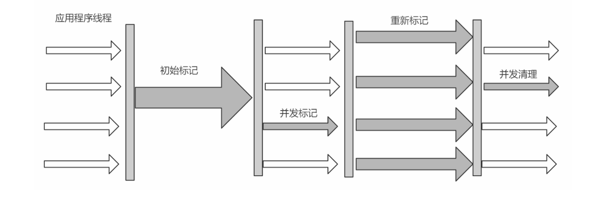

**优点：**并发收集、低停顿
**缺点：**产生大量空间碎片、并发阶段会降低吞吐量

###  G1(Garbage-First)（即适用于老年代也适用于新生代）

使用G1收集器时，Java堆的内存布局与就与其他收集器有很大差别，它**将整个Java堆划分为多个大小相等的独立区域（Region）**，虽然还**保留有新生代和老年代的概念，但新生代和老年代不再是物理隔离**的了，它们**都是一部分Region（不需要连续）的集合。**
每个Region大小都是一样的，可以是1M到32M之间的数值，但是必须保证是2的n次幂如果对象太大，一个Region放不下[超过Region大小的50%]，那么就会直接放到H中设置Region大小：-XX:G1HeapRegionSize=M。所谓Garbage-Frist，其实就是优先回收垃圾最多的Region区域

> （1）分代收集（仍然保留了分代的概念）
> （2）空间整合（**整体上属于“标记-整理”算法，不会导致空间碎片**）
> （3）可预测的停顿（比CMS更先进的地方在于能让使用者明确指定一个长度为M毫秒的时间片段内，消
> 耗在垃圾收集上的时间不得超过N毫秒）

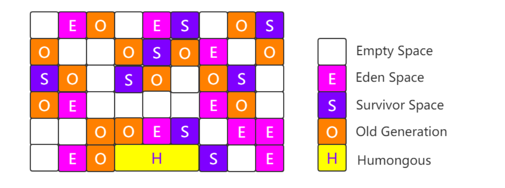

工作过程可以分为如下几步

> 初始标记（Initial Marking） 标记GC Roots能够关联的对象，并且修改TAMS的值，需要暂
> 停用户线程
> 并发标记（Concurrent Marking） 从GC Roots进行可达性分析，找出存活的对象，与用户线程并发
> 执行
> 最终标记（Final Marking） 修正在并发标记阶段因为用户程序的并发执行导致变动的数据，需
> 暂停用户线程
> 筛选回收（Live Data Counting and Evacuation） 对各个Region的回收价值和成本进行排序，根据
> 用户所期望的GC停顿时间制定回收计划

**ps:**如果有大对象放不下Region区，会直接放到H中

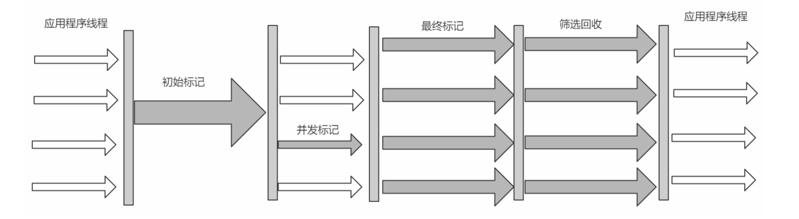

###  ZGC**？？？**

JDK11新引入的ZGC收集器，不管是物理上还是逻辑上，ZGC中已经不存在新老年代的概念了
会分为一个个page，当进行GC操作时会对page进行压缩，因此没有碎片问题
只能在64位的linux上使用，目前用得还比较少

> （1）可以达到10ms以内的停顿时间要求
> （2）支持TB级别的内存
> （3）堆内存变大后停顿时间还是在10ms以内

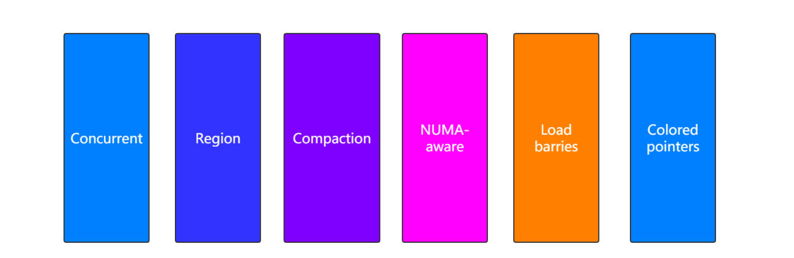

**（不懂，查资料。。。。。）**

### 各种GC总结 

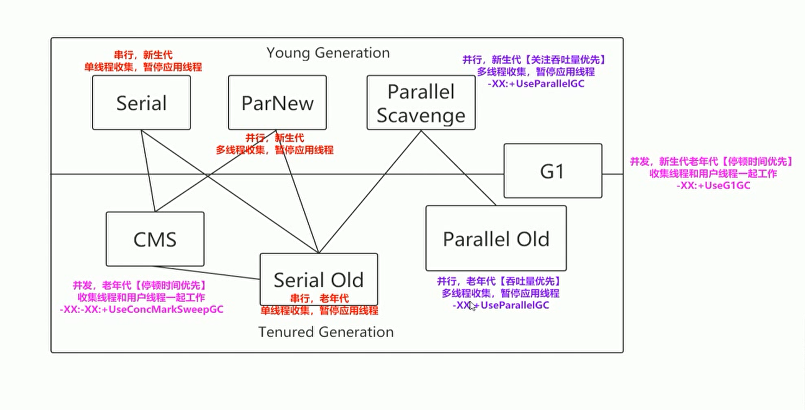

评价垃圾收集器的好坏：停顿时间和吞吐量

## 如何选择合适的垃圾收集器

​	根据自己程序的需要和运行程序机器的硬件设备，比如程序内存小一般使用SerialGC,如果对吞吐量要求比较高，则可以选择Parallel ScavengeGC，如果对停顿时间的要求而很严格则可以选用CMSGC过着G1GC

# JVM参数

- 标准参数

> -version
>
> -help
>
> -server
>
> -cp

- 非标准参数【也就是说在jdk版本中可能会有变动】

> -X参数
>
> 
>
> -XX参数
>
> 使用得最多的参数类型
> 非标准化参数，相对不稳定，主要用于JVM调优和Debug
>
> 其他参数（这块也相当于是-XX类型的参数**一种简写**）：
>
> -Xms1000M等价于-XX:InitialHeapSize=1000M
> -Xmx1000M等价于-XX:MaxHeapSize=1000M
> -Xss100等价于-XX:ThreadStackSize=100

## 查看参数

java -XX:+PrintFlagsFinal -version > flags.txt

**注意：** 值得注意的是"="表示默认值，":="表示被用户或JVM修改后的值
			要想查看某个进程具体参数的值，可以使用jinfo，这块后面聊
			一般要设置参数，可以先查看一下当前参数是什么，然后进行修改

## 设置参数的方法

- 开发工具中设置比如IDEA，eclipse
- 运行jar包的时候:java -XX:+UseG1GC xxx.jar
- web容器比如tomcat，可以在脚本中的进行设置
- 通过jinfo实时调整某个java进程的参数(参数只有被标记为manageable的flags可以被实时修改)

## 常用参数

| 参数                                                         | 含义                                                         | 说明                                                         |
| ------------------------------------------------------------ | ------------------------------------------------------------ | :----------------------------------------------------------- |
| -XX:CICompilerCount=3                                        | 最大并行编译数                                               | 如果设置大于1，虽然编译速度回提高，但是同样影响系统稳定性增加VM崩溃的可能 |
| -XX:InitialHeapSize=100M                                     | 初始化堆大小                                                 | 简写-Xms100M                                                 |
| -XX:MaxHeapMax=100M                                          | 最大堆大小                                                   | 简写-Xmx100M                                                 |
| -XX:NewSize=20M                                              | 设置年轻代的大小                                             |                                                              |
| -XX:MaxNewSize=50M                                           | 设置年轻代最大大小                                           |                                                              |
| -XX:OldSize=50M                                              | 设置老年代的大小                                             |                                                              |
| -XX:MetaspaceSize=500M                                       | 方法区最大大小                                               |                                                              |
| -XX:+UseParallelGC                                           | 使用ParallelGC                                               | 新生代，吞吐量优先                                           |
| -XX:UserParallelOldGC                                        | 使用ParallelOldGC                                            | 老年代，吞吐量优先                                           |
| -XX:UserConcMarkSweepGC                                      | 使用CMSGC                                                    | 老年代，停顿时间优先                                         |
| -XX:UserG1GC                                                 | 使用G1GC                                                     | 新生代和老年代，停顿时间邮箱                                 |
| -XX:NewRatio                                                 | 新老年代的比值                                               | 比如-XX:Ratio=4，则表示新生代:老年代=1:4，也就是新生代占整个堆内存的1/5 |
| -XX:SurvivorRatio                                            | 两个S区和Eden区的比值                                        | 比如-XX:SurvivorRatio=8，也就是(S0+S1):Eden=2:8，也就是一个S占整个新生代的1/10 |
| -XX:+HeapDumpOnOutOfMemoryError                              | 启动堆内存溢出打印                                           | 当JVM堆内存发生溢出时，也就是OOM，自动生成dump文件           |
| -XX:HeapDumpPath=heap.hprof                                  | 指定堆内存溢出打印目录                                       | 表示在当前目录生成一个heap.hprof文件                         |
| -XX:+PrintGCDetails -\<br/\>XX:+PrintGCTimeStamps -\<br/\>XX:+PrintGCDateStamps -Xloggc:g1-gc.log | 打印出GC日志                                                 | 可以使用不同的垃圾收集器，对比查看GC情况                     |
| -Xss128k                                                     | 设置每个线程的堆栈大小                                       | 经验值是3000-5000最佳                                        |
| -XX:MaxTenuringThreshold=6                                   | 提升年老代的最大临界值                                       | 默认值为 15                                                  |
| -XX:InitiatingHeapOccupancyPercent                           | 启动并发GC周期时堆内存使用占比                               | G1之类的垃圾收集器用它来触发并发GC周期,基于整个堆的使用率,而不只是某 一代内存的使用比. 值为 0 则表示”一直执行GC循环”. 默认值为 45. |
| -XX:G1HeapWastePercent                                       | 允许的浪费堆空间的占比                                       | 默认是10%，如果并发标记可回收的空间小于10%,则不会触发MixedGC。 |
| -XX:MaxGCPauseMillis=200ms                                   | G1最大停顿时间                                               | 暂停时间不能太小，太小的话就会导致出现G1跟不上垃圾产生的速度。最终退化成Full GC。所以对这个参数的调优是一个持续的过程，逐步调整到最佳状态。 |
| -XX:ConcGCThreads=n                                          | 并发垃圾收集器使用的线程数量                                 | 默认值随JVM运行的平台不同而不同                              |
| -XX:G1MixedGCLiveThresholdPercent=65                         | 混合垃圾回收周期中要包括的旧区域设置占用率阈值               | 默认占用率为 65%                                             |
| -XX:G1MixedGCCountTarget=8                                   | 设置标记周期完成后，对存活数据上限为 G1MixedGCLIveThresholdPercent 的旧区域执行混合垃 圾回收的目标次数 | 默认8次混合垃圾回收，混合回收的目标是要控制在此目标次数以内  |
| -XX:G1OldCSetRegionThresholdPercent=1                        | 描述Mixed GC时，Old Region被加入到CSet中                     | 默认情况下，G1只把10%的Old Region加入到CSet中                |
|                                                              |                                                              |                                                              |
|                                                              |                                                              |                                                              |

# JAVA Tools

## 常用命令

> 这些命令都可以直接在cmd（命令行窗口）运行，前提是配置好了java的环境变量

### jps：查看java进程

> linux好像是ps

### jinfo：

- 实时查看和调整JVM配置参数
- 查看用法：jinfo -flag name PID     查看某个java进程的那么属性的值

> PID可以使用jps来查看

- 修改：参数只有被标记为mangeable的flags可以被实时修改

> eg：jinfo -flag [+/-] PID
>
> ​		jinfo -flag \<name\> = \<value\> PID

- 查看曾经赋过值的一些参数

> jinfo f-lags PID

### jstat:

- 查看虚拟机性能统计信息
- 查看类装载信息

> eg：jstat -class PID 1000 10     查看某个java进程的类装载信息，每1000毫秒输出一次，一共输出10次

- 查看垃圾收集信息

> eg：jstat -gc PID 1000 10

### jstack

- 查看线程堆栈信息
- 用法：

> jstack PID

- 排查死锁案例

### jmap

- 生成堆存储快照

- 打印输出堆内存相关信息：jamp -heap PID
- dump出堆内存的相关信息

> eg:   jamp -dump:format=b, file=heap.hprof PID

- 要是在发生堆内存溢出的时候，能自动dump出该文件就好了

> 一般在开发中，JVM参数可以加上下面两句，这样内存溢出时，会自动dump出该文件
> -XX:+HeapDumpOnOutOfMemoryError -XX:HeapDumpPath=heap.hprof
>
> heap.hrof:运行程序当前目录
>
> 关于dump下来的文件，一般dump下来的文件可以结合下面的工具来分析

## 常用工具

> 某种意义上是对命令参数的封装

### JVM自带工具

#### jconsole

JConsole工具是JDK自带的可视化监控工具。查看java应用程序的运行概况、监控堆信息、永久区使用
情况、类加载情况等。

> 命令行中输入：jconsole

####  jvisualvm

> 命令行中输入：jvisualvm
> Visual GC插件下载地址 ：https://visualvm.github.io/pluginscenters.html

**作用：**

- 监控本地Java进程：可以监控本地的java进程的CPU，类，线程等
- 监控远端Java进程**（不会的。。。。。。。。。。。。。。。）**

> （1）在visualvm中选中“远程”，右击“添加”
> （2）主机名上写服务器的ip地址，比如39.100.39.63，然后点击“确定”
> （3）右击该主机"39.100.39.63"，添加“JMX”，也就是通过JMX技术具体监控远端服务器哪个Java进程
> （4）要想让服务器上的tomcat被连接，需要改一下Catalina.sh这个文件
>
> （5）在../conf文件中添加两个文件jmxremote.access和jmxremote.password
>
> （6）将连接服务器地址改为公网ip地址
>
> （7）设置上述端口对应的阿里云安全策略和防火墙策略
> （8）启动tomcat，来到bin目录
>
> （9）查看tomcat启动日志以及端口监听
>
> （10）查看8998监听情况，可以发现多开了几个端口
>
> （11）在刚才的JMX中输入8998端口，并且输入用户名和密码则登录成功

#### arthas

github ：https://github.com/alibaba/arthas

Arthas 是Alibaba开源的Java诊断工具，采用命令行交互模式，是排查jvm相关问题的利器。

##### 下载安装

curl -O https://alibaba.github.io/arthas/arthas-boot.jar
java -jar arthas-boot.jar
or
java -jar arthas-boot.jar -h

然后可以选择一个Java进程

> 常用命令：
>
> version:查看arthas版本号
> help:查看命名帮助信息
> cls:清空屏幕
> session:查看当前会话信息
> quit:退出arthas客户端

### 内存分析

#### MAT

> Java堆分析器，用于查找内存泄漏
> Heap Dump，称为堆转储文件，是Java进程在某个时间内的快照。
> 它在触发快照的时候保存了很多信息：Java对象和类信息。
> 通常在写Heap Dump文件前会触发一次Full GC。
> 下载地址 ：https://www.eclipse.org/mat/downloads.php

1. 获取dump文件：

   1. 手动
      - jmap -dump:format=b,file=heap.hprof 44808
   2. 自动
      - -XX:+HeapDumpOnOutOfMemoryError -XX:HeapDumpPath=heap.hprof
2. Dump的信息

> 

1. 使用

   - Histogram：可以列出内存中的对象，对象的个数及其大小

   > Class Name:类名称，java类名
   > Objects:类的对象的数量，这个对象被创建了多少个
   > Shallow Heap:一个对象内存的消耗大小，不包含对其他对象的引用
   > Retained Heap:是shallow Heap的总和，即该对象被GC之后所能回收到内存的总和
   >
   > 
   >
   > 右击类名--->List Objects--->with incoming references--->列出该类的实例
   > 右击Java对象名--->Merge Shortest Paths to GC Roots--->exclude all ...--->找到GC
   > Root以及原因

   - Leak Suspects：查找并分析内存泄漏的可能原因

   > Reports--->Leak Suspects--->Details

   - Top Consumers：列出大对象

#### heaphero：https://heaphero.io/

#### perfma:https://console.perfma.com/

### GC日志分析

要想分析日志的信息，得先拿到GC日志文件才行，所以得先配置一下，根据前面参数的学习，下
面的配置很容易看懂。比如打开windows中的catalina.bat，在第一行加上

> XX:+PrintGCDetails -XX:+PrintGCTimeStamps -XX:+PrintGCDateStamps
> -Xloggc:$CATALINA_HOME/logs/gc.log

#### 不同收集器日志

这样使用startup.bat启动tomcat的时候就能够在当前目录下拿到gc.log文件，可以看到默认使用的是
ParallelGC。

**GCViewer：**java -jar gcviewer-1.36-SNAPSHOT.jar

 **gceasy：**http://gceasy.io

**gcplot：**https://it.gcplot.com/

# 执行引擎

> Person.java源码文件是Java这门高级开发语言，对程序员友好，方便我们开发。
> javac编译器将Person.java源码文件编译成class文件[我们把这里的编译称为前期编译]，交给JVM运
> 行，因为JVM只能认识class字节码文件。同时在不同的操作系统上安装对应版本的JDK，里面包含了各自屏
> 蔽操作系统底层细节的JVM，这样同一份class文件就能运行在不同的操作系统平台之上，得益于JVM。这也
> 是Write Once，Run Anywhere的原因所在。
> 最终JVM需要把字节码指令转换为机器码，可以理解为是0101这样的机器语言，这样才能运行在不同的机器
> 上，那么由字节码转变为机器码是谁来做的呢？说白了就是谁来执行这些字节码指令的呢？这就是执行引擎

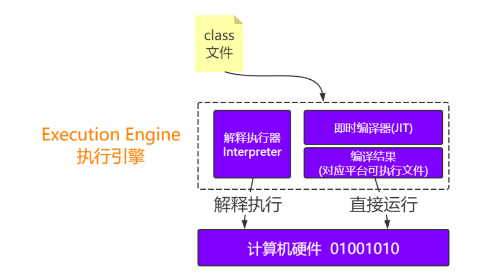

## 解释执行

Interpreter，解释器逐条把字节码翻译成机器码并执行，跨平台的保证。
刚开始执行引擎只采用了解释执行的，但是后来发现某些方法或者代码块被调用执行的特别频繁时，就
会把这些代码认定为“热点代码”。

## 即时编译器

Just-In-Time compilation(JIT)，即时编译器先将字节码编译成对应平台的可执行文件，运行速度快。
即时编译器会把这些热点代码编译成与本地平台关联的机器码，并且进行各层次的优化，保存到内存
中。

### JVM采用哪种方式？

JVM采用的事混合模式，也就是解析+编译的方式，对于大部分不常用的代码，不需要浪费时间去将其编译成机器码，只需要用到的时候再以解释的方式运行；对于小部分热点代码，可以采取编译的方式，追求更高的运行效率。

> **即时编译期的类型：**
>
> 1）HotSpot虚拟机里面内置了两个JIT：C1和C2
>
> ​		C1也称为Client Compiler，适用于执行时间短或者对启动性能有要求的程序
>
> ​		C2也称为Server Compiler，适用于执行时间长或者对峰值性能有要求的程序
>
> 2）Java7开始，HotSpot会使用分层编译的方式
>
> ​		也就是会结合C1的启动性能优势和C2的峰值性能优势，热点方法会先被C1编译，然后热点方法中的热点会被
> C2再次编译
>
> **AOT和Graal VM**
>
> ​	AOT：
>
> ​			在Java9中，引入了AOT(Ahead-Of-Time)编译器
>
> ​				即时编译器是在程序运行过程中，将字节码翻译成机器码。而AOT是在程序运行之前，将字节码转换为机器码
> ​				**优势 ：**这样不需要在运行过程中消耗计算机资源来进行即时编译
> ​				**劣势 ：**AOT 编译无法得知程序运行时的信息，因此也无法进行基于类层次分析的完全虚方法内联，或
> ​							者基于程序 profile 的投机性优化（并非硬性限制，我们可以通过限制运行范围，或者利用上一次运行
> ​							的程序 profile 来绕开这两个限制）
>
> **Graal VM**
>
> 在Java10中，新的JIT编译器Graal被引入。
> 它是一个以Java为主要编程语言，面向字节码的编译器。跟C++实现的C1和C2相比，模块化更加明显，也更加容易维护。
> Graal既可以作为动态编译器，在运行时编译热点方法；也可以作为静态编译器，实现AOT编译。
> 除此之外，它还移除了编程语言之间的边界，并且支持通过即时编译技术，将混杂了不同的编程语言的
> 代码编译到同一段二进制码之中，从而实现不同语言之间的无缝切换。
>
> 

# JVM性能优化

> JVM的性能优化可以分为代码层面和非代码层面。
> 在代码层面，大家可以结合字节码指令进行优化，比如一个循环语句，可以将循环不相关的代码提取到循环体之外，这样在字节码层面就不需要重复执行这些代码了。
> 在非代码层面，一般情况可以从内存、gc以及cpu占用率等方面进行优化。
> 注意，JVM调优是一个漫长和复杂的过程，而在很多情况下，JVM是不需要优化的，因为JVM本身已经做了很多的内部优化操作。
> 那今天我们就从内存、gc以及cpu这3个方面和大家一起探讨一下JVM的优化，但是大家要注意的是**不要为了调优和调优**。

## 代码层面

> java内存模型：描述的是线程的工作内存和堆的主存之间是如通信的

## 非代码层面

## 内存

### 内存分配

正常情况下不需要设置，那如果是促销或者秒杀的场景呢？
每台机器配置2c4G，以每秒3000笔订单为例，整个过程持续60秒

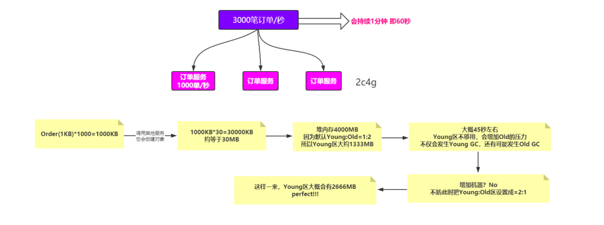

### 内存溢出

- 大并发
- 内存泄漏

### 垃圾回收：要保证停顿时间少，吞吐量大，GC次数少

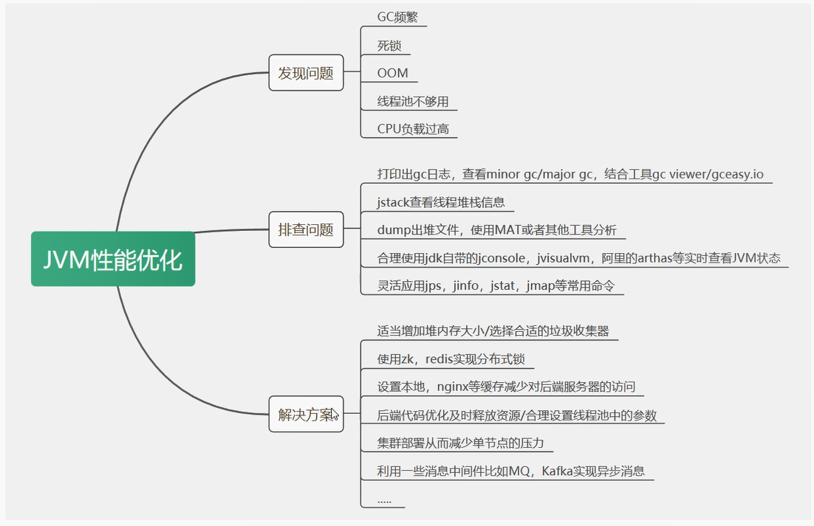

# 最后

