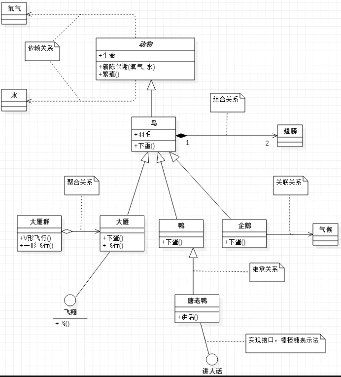

# UML 介绍
**UML这三个字母的全称是Unified Modeling Language，直接翻译就是统一建模语言，简单地说就是一种有特殊用途的语言。 **

## 对象 类型介绍
- 接口
 - 《interface》

## 属性表示
> -表示private  
> #表示protected 
> ~表示default,也就是包权限  
> _下划线表示static  
> 斜体表示抽象

## 继承和实现
> 实现是： 类 虚线 空心箭头  指向 接口
> 继承是： 子类 实线 空心箭头  指向 父类

## 关系

> 依赖： 虚线 箭头
> 关联： 实心 箭头 虚线插中间表示依赖关系
> 聚合： 集合类 空心菱形 实线  箭头  个体 虚线插中间表示聚合关系
> 组合： 大 实心菱形 实线 箭头 小  虚线插中间表示组合关系

## 示例

