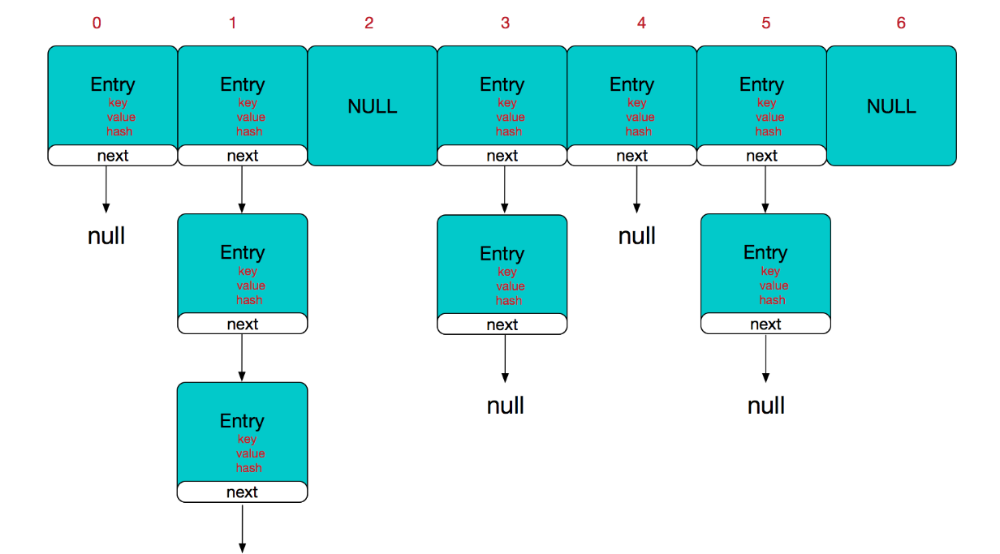
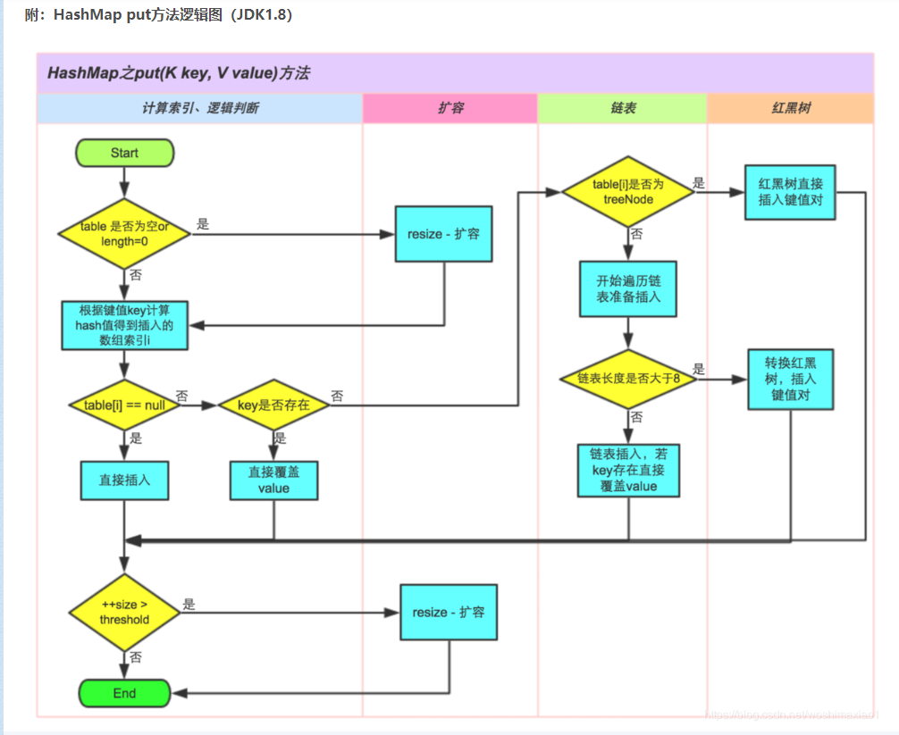

# Map（存储键值对，键唯一）

## 类型介绍：

-  通用Map，用于在应用程序中管理映射，通常在 java.util 程序包中实现

> HashMap结构的实现原理是将out进来的key-value封装成一个Entry对象，再存储到一个Entry类型的数组中去，数组下标由key的哈希值与数组长度来计算。如果数组当前下标已有值，则将数组的当前下标指向新添加的Entry对象

- 专用Map，通常我们不必亲自创建此类Map，而是通过某些其他类对其进行访问

> java.util.jar.Attributes、javax.print.attribute.standard.PrinterStateReasons、java.security.Provider、java.awt.RenderingHints、javax.swing.UIDefaults

- 一个用于帮助我们实现自己的Map类的抽象类：AbstractMap

## 类型区别：

**HashMap**：

最常用的Map,它根据键的HashCode 值存储数据,根据键可以直接获取它的值，**具有很快的访问速度**。HashMap最多**只允许一条记录的键为Null(多条会覆盖)**;**允许多条记录的值为 Null。非同步的。**（线程不安全）

**TreeMap：**

能够把它保存的记录根据**键(key)排序**,**默认是按升序**排序，也**可以指定排序**的比较器，当用Iterator 遍历TreeMap时，得到的记录是排过序的。**TreeMap不允许key的值为null**。非同步的。

**HashTable：**

与 HashMap类似,不同的是:**key和value的值均不允许为null**;它支持线程的同步，即任一时刻只有一个线程能写Hashtable,因此也导致了Hashtale在写入时会比较慢。**（与HashMap相比它是线程安全的）**

**LinkedHashMap：**

**保存了记录的插入顺序**，在用Iterator遍历LinkedHashMap时，先得到的记录肯定是先插入的.在**遍历的时候会比HashMap慢。key和value均允许为空，非同步的。** **（线程不安全）**

## Map的基本操作

> map初始化：Map<String, String> map = new HashMap<String, String>();
>
> 插入元素：map.put("key", "value"); **插入时如果key已经存在，则新value覆盖旧value，并返回旧value**
>
> 获取元素：map.get("Key1");
>
> 移出元素：map.remove("key1");
>
> 清空map：map.clear():

## HashMap的实现原理

HashMap主干是一个Entry数组。Entry是HashMap的基本组成单位，每一个Entry都包含一个Key-Value键值对。（所谓的Map其实就是保存了两个对象之间的映射关系的一种集合）

```java
//HashMap的主干数组，可以看到就是一个Entry数组，初始值为空数组{}，主干数组的长度一定是2的次幂。
transient Entry<K,V>[] table = (Entry<K,V>[]) EMPTY_TABLE;
```

Entry是HashMap的一个静态内部类

```java
static class Entry<K,V> implements Map.Entry<K,V> {
    final K key;
    V value;
    Entry<K,V> next;//存储指向下一个Entry的引用，单链表结构
    int hash;//对key的hashcode值进行hash运算后得到的值，存储在Entry，避免重复计算

    /**
     * Creates new entry.
     */
    Entry(int h, K k, V v, Entry<K,V> n) {
        value = v;
        next = n;
        key = k;
        hash = h;
} 
```

**HashMap的结构图示化**



> HashMap由**数组+链表**组成的，它的主干是数组，链表的主要是为了解决哈希冲突而存在的。如果定位到的数组位置没有链表（next指向null），则查找、添加的操作就会非常快，仅需要一次寻址就可以了。如果定位的位置有链表，对于添加操作来说，需要遍历链表，存在则覆盖，否则新增；对于查找来说，还是需要遍历链表，然后通过key的equals方法比对查找。就性能来考虑，**HashMap中的链表出现越少，性能就越好。**

**其他的重要字段**

```java
/**实际存储的key-value键值对的个数*/
transient int size;

/**阈值，当table == {}时，该值为初始容量（初始容量默认为16）；当table被填充了，也就是为table分配内存空间后，
threshold一般为 capacity*loadFactory。HashMap在进行扩容时需要参考threshold，后面会详细谈到*/
int threshold;

/**负载因子，代表了table的填充度有多少，默认是0.75
加载因子存在的原因，还是因为减缓哈希冲突，如果初始桶为16，等到满16个元素才扩容，某些桶里可能就有不止一个元素了。
所以加载因子默认为0.75，也就是说大小为16的HashMap，到了第13个元素，就会扩容成32。
*/
final float loadFactor;

/**HashMap被改变的次数，由于HashMap非线程安全，在对HashMap进行迭代时，
如果期间其他线程的参与导致HashMap的结构发生变化了（比如put，remove等操作），
需要抛出异常ConcurrentModificationException*/
transient int modCount;
```

HashMap有四个构造器，如果用户没有哦传入initialCapacity（初始容量）和loadFactor（负载因子），会使用默认值

initialCapacity的默认值**16**，loadFactor的默认值**0.75**

**其中一个构造函数**

```java
public HashMap(int initialCapacity, float loadFactor) {
    //此处对传入的初始容量进行校验，最大不能超过MAXIMUM_CAPACITY = 1<<30(230)
    if (initialCapacity < 0)
        throw new IllegalArgumentException("Illegal initial capacity: " +
                                           initialCapacity);
    if (initialCapacity > MAXIMUM_CAPACITY)
        initialCapacity = MAXIMUM_CAPACITY;
    if (loadFactor <= 0 || Float.isNaN(loadFactor))
        throw new IllegalArgumentException("Illegal load factor: " +
                                           loadFactor);

    this.loadFactor = loadFactor;
    threshold = initialCapacity;

    init();//init方法在HashMap中没有实际实现，不过在其子类如 linkedHashMap中就会有对应实现
}
```

> 从该构造函数可以看出，在常规构造器中，并没有为数组table分配内存空间（有一个入参为指定Map的构造器除外），**而是在指定put操作是才真正的构造table数组**

**put操作**

```java
public V put(K key, V value) {
    //如果table数组为空数组{}，进行数组填充（为table分配实际内存空间），入参为threshold，
    //此时threshold为initialCapacity 默认是1<<4(24=16)
    if (table == EMPTY_TABLE) {
        inflateTable(threshold);
    }
    //如果key为null，存储位置为table[0]或table[0]的冲突链上
    if (key == null)
        return putForNullKey(value);
    int hash = hash(key);//对key的hashcode进一步计算，确保散列均匀
    int i = indexFor(hash, table.length);//获取在table中的实际位置
    for (Entry<K,V> e = table[i]; e != null; e = e.next) {
        //如果该对应数据已存在，执行覆盖操作。用新value替换旧value，并返回旧value
        Object k;
        if (e.hash == hash && ((k = e.key) == key || key.equals(k))) {
            V oldValue = e.value;
            e.value = value;
            e.recordAccess(this);
            return oldValue;
        }
    }
    modCount++;//保证并发访问时，若HashMap内部结构发生变化，快速响应失败
    addEntry(hash, key, value, i);//新增一个entry
    return null;
}
```

> inflataTable这个方法主要用于为table主干数组在内存中分配存储空间，通过roundUpToPowerOf2(toSize)这个方法保证capacity的值为大于或等于toSize的二次幂（**capacity为一个二次幂，这个二次幂最接近toSize**）。

```java
private void inflateTable(int toSize) {
    int capacity = roundUpToPowerOf2(toSize);//capacity一定是2的次幂
    /**此处为threshold赋值，取capacity*loadFactor和MAXIMUM_CAPACITY+1的最小值，
        capaticy一定不会超过MAXIMUM_CAPACITY，除非loadFactor大于1 */
    threshold = (int) Math.min(capacity * loadFactor, MAXIMUM_CAPACITY + 1);
    table = new Entry[capacity];
    initHashSeedAsNeeded(capacity);
}
```

> roundUpToPowerOf2()这个方法使得数组长度一定为2的次幂，Integer.highestOneBit是用来获取最左边的bit（其他位的bit为0）所代表的数值

```java
 private static int roundUpToPowerOf2(int number) {
     // assert number >= 0 : "number must be non-negative";
     return number >= MAXIMUM_CAPACITY
         ? MAXIMUM_CAPACITY
         : (number > 1) ? Integer.highestOneBit((number - 1) << 1) : 1;
}
```

**hash函数：**

```java
/**这是一个神奇的函数，用了很多的异或，移位等运算
对key的hashcode进一步进行计算以及二进制位的调整等来保证最终获取的存储位置尽量分布均匀*/
final int hash(Object k) {
    int h = hashSeed;
    if (0 != h && k instanceof String) {
        return sun.misc.Hashing.stringHash32((String) k);
    }

    h ^= k.hashCode();

    h ^= (h >>> 20) ^ (h >>> 12);
    return h ^ (h >>> 7) ^ (h >>> 4);
}
```

hash函数算出来的值，通过indexFor进一步处理来获取实际的存储位置：

```java
/** * 返回数组下标 */static int indexFor(int h, int length) {    return h & (length-1);}
```

> h & (length - 1) 保证了获取的index一定在数组范围内。
>
> 位运算对计算机来说，性能要高一些，HashMap中有大量的位运算

最终的存储位置的确定过程如下：

**key --hashCode()---> hashCode ---hesh()--->  h  ----indexFor()+h & (length - 1)--->存储下标**

addEntry的实现

```java
void addEntry(int hash, K key, V value, int bucketIndex) {    
    if ((size >= threshold) && (null != table[bucketIndex])) {        
        resize(2 * table.length);//当size超过临界阈值threshold，并且即将发生哈希冲突时进行扩容        
        hash = (null != key) ? hash(key) : 0;        
        bucketIndex = indexFor(hash, table.length);
    }    
    createEntry(hash, key, value, bucketIndex);
}
```

> 上述代码可知，**当发生哈希冲突并且size大于阈值时，需要进行数组扩容，扩容时需要新建一个长度为之前数组两倍的新的数组，然后将当前的Entry数组中的元素全部传输过去，扩容的新数组的长度是之前的两倍，所以扩容相对来说是个耗资源的操作。**

**get方法**

```java
public V get(Object key) {    //如果key为null,则直接去table[0]处去检索即可。    
    if (key == null)        
        return getForNullKey();    
    Entry<K,V> entry = getEntry(key);    
    return null == entry ? null : entry.getValue(); 
}
```

get方法通过key值返回对应的value，如果key为null，直接去 table[0] 处检索。

**getEntry方法：**

```java
final Entry<K,V> getEntry(Object key) {                
    if (size == 0) {        
        return null;    
    }    
    //通过key的hashcode值计算hash值    
    int hash = (key == null) ? 0 : hash(key);    //indexFor (hash&length-1) 获取最终数组索引，然后遍历链表，通过equals方法比对找出对应记录
    for (Entry<K,V> e = table[indexFor(hash, table.length)]; e != null; e = e.next) {       
        Object k;        
        if (e.hash == hash && ((k = e.key) == key || (key != null && key.equals(k))))            
            return e;    
    }    
    return null;
}    
```

​                        **key(hashcode) ----->   hash  ------>  indexFor  ----->  最终索引位置**

​	找到对应的table[i] 的位置，在查看是否有链表，有链表的话遍历，通过key的equals方法比对查找对应的记录。

## HashMap1.8的优化

- 增加了红黑树，就是当链表长度超过8时，链表会转换为红黑树。利用红黑树快速增删改查的特点提高HashMap的性能。

  把时间复杂度从O(n) 变成O(Logn) 提高效率

- jdk1.7采用的头插法，而jdk1.8之后采用的事尾插法。

> jdk1.7使用单链表进行的纵向延伸，采用头插法能够提高插入的效率，但是也容易出现逆序且环形链表死循环问题。
>
> jdk1.8之后由于加入了红黑树使用尾插法，能够避免逆序且环形链表死循环的问题。

- 扩容后数据存储位置的计算方式不一样了

> 1.7的时候是直接用hash值和需要扩容的二进制进行&（按位与）运算。
>
> 1.8之后采用 **扩容前的位置+扩容的大小值==的计算方式** 

## HashMap为啥事线程不安全的

HashMap在并发时出现的问题主要在两个方面

1. put的时候导致的多线程数据不一致

   比如当线程A刚刚计算出下标位置，并且获取到了链表头结点时时间片用完了，此时线程B计算的下标位置与线程A一样，并完成了插入功能，此时A继续执行，对B的操作一无所知，继续完成它的插入，此时就将B的数据覆盖了，由此产生了数据不一致的问题。

2. resize而引起死循环

   当两个线程同时检测到元素个数超过阈值，一起进行扩容，两个线程同时修改一个链表会产生一个循环链表（JDK1.7中会出现resize前后元素倒置的情况）。接下来再get的时候就会出现死循环。

> ## HaspMap和HashTable的区别
>
> - HashMap和HashTable几乎是等价的，除了HashMap是非synchronized的，并可以接受null值。（HashMap可以接受为null的键和值，而HashTable是不可以的）（ HashMap最多只允许一条记录的键为null，允许多条记录的值为null）
> - HashMap是非synchronized的，而HashTable是synchronized的。这以为着HashTable是线程安全的，多个线程可以共享一个HashTable；而如果没有正确同步的话，多个线程不能共享HashMap。JAVA5提供了ConcurrentHashMap，它是HashTable的替代，比HashTable的扩容性更好。
> - 两者的迭代器是不一样的，HashMap的迭代器是fail-fast迭代器，HashTable的enumerator迭代器不是fail-fast
> - 由于HashTable是线程安全的又是synchronized的，所以它要比HashMap慢。 **（如果需要满足线程安全，可以用 Collections的synchronizedMap方法使HashMap具有线程安全的能力，或者使用ConcurrentHashMap。）**
> - HashMap不能保证随着时间的推移Map中的元素次序是不变的。
> - HashTable继承Dictionary类。


 




## Map遍历

### 增强for循环遍历

**使用keySet()遍历**

```java
for (String key : map.keySet()) {    System.out.println(key + " ：" + map.get(key));}
```

**使用entrySet()遍历**

```java
for (Map.Entry<String, String> entry : map.entrySet()) {    System.out.println(entry.getKey() + " ：" + entry.getValue());}
```

### 迭代器遍历

**使用keySet()遍历**

```java
Iterator<String> iterator = map.keySet().iterator();while (iterator.hasNext()) {    String key = iterator.next();    System.out.println(key + "　：" + map.get(key));}
```

**使用entrySet()遍历**

```java
Iterator<Map.Entry<String, String>> iterator = map.entrySet().iterator();while (iterator.hasNext()) {    Map.Entry<String, String> entry = iterator.next();    System.out.println(entry.getKey() + "　：" + entry.getValue());}
```


> HashMap在jdk1.7和jdk1.8中的区别
>
> jdk1.8之前存储结构采用数组加链表的形式，jdk1.8之后采用数组加链表加红黑树的结构。


