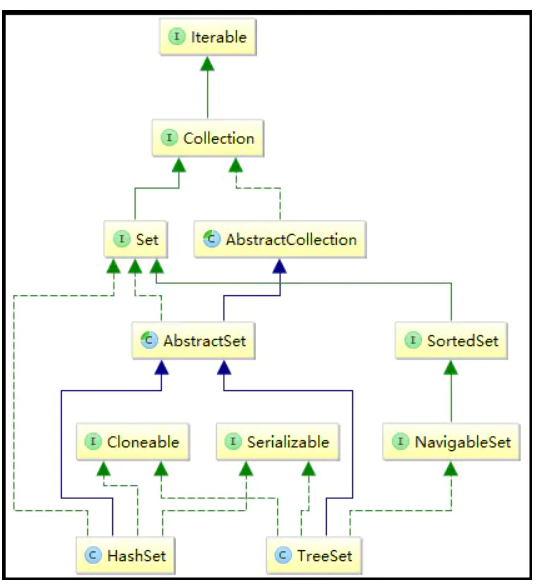

# Set		

Set继承于Collection接口，是一个**不允许出现重复元素，并且无序的集合**，主要有**HashSet**和**TreeSet**两大实现类。

> 在判断重复元素的时候，Set集合会调用hashCode()和equal()方法来实现。

**set集合框架：**



## HashSet

HashSet是哈希表结构，主要利用HashMap的key来存储元素，计算插入元素的hashCode来获取元素在集合中的位置；

> HashSet实现Set接口，底层由HashMap来实现，为哈希表结构，**新增元素相当于HashMap的key，value默认为一个固定的Object**。
>
> 当有元素插入的时候，会计算元素的hashCode值，将元素插入到哈希表对应的位置中来；
>
> 它继承于AbstractSet，实现了Set, Cloneable, Serializable接口。
>
> (1)HashSet继承AbstractSet类，获得了Set接口大部分的实现，减少了实现此接口所需的工作，实际上是又继承了AbstractCollection类；
>
> (2)HashSet实现了Set接口，获取Set接口的方法，可以自定义具体实现，也可以继承AbstractSet类中的实现；
>
> (3)HashSet实现Cloneable，得到了clone()方法，可以实现克隆功能；
>
> (4)HashSet实现Serializable，表示可以被序列化，通过序列化去传输，典型的应用就是hessian协议。

特点：

- 不允许出现重复元素
- 允许插入null值
- 元素无序（添加顺序和遍历顺序不一致）
- 线程不安全，如两个线程同时操作HashSet，必须通过代码实现同步

**HashSet的基本操作**

由于Set集合中并没有角标的概念，所以并没有像List一样提供get（）方法。当获取HashSet中某个元素时，只能通过遍历集合的方式进行equals()比较来实现；

```java
public void test(){        
    //创建HashSet集合：        
    Set<String> hashSet = new HashSet<String>();        
    System.out.println("HashSet初始容量大小："+hashSet.size());        
    //元素添加：        
    hashSet.add("my");        
    hashSet.add("name");        
    hashSet.add("is");        
    hashSet.add("jiaboyan");        
    hashSet.add(",");        
    hashSet.add("hello");        
    hashSet.add("world");        
    hashSet.add("!");        
    System.out.println("HashSet容量大小："+hashSet.size());        
    //迭代器遍历：        
    Iterator<String> iterator = hashSet.iterator();        
    while (iterator.hasNext()){            
        String str = iterator.next();            
        System.out.println(str);        
    }        
    //增强for循环        
    for(String str:hashSet){            
        if("jiaboyan".equals(str)){                
            System.out.println("你就是我想要的元素:"+str);            
        }            
        System.out.println(str);        }        
    //元素删除：       
    hashSet.remove("jiaboyan");        
    System.out.println("HashSet元素大小：" + hashSet.size());        
    hashSet.clear();        
    System.out.println("HashSet元素大小：" + hashSet.size());        
    //集合判断：        
    boolean isEmpty = hashSet.isEmpty();        
    System.out.println("HashSet是否为空：" + isEmpty);        
    boolean isContains = hashSet.contains("hello");        
    System.out.println("HashSet是否为空：" + isContains);    
}
```

### HashSet元素添加不允许重复分析

在向HashSet中添加元素时会先判断它的hash值是否相同，相同的话再进行equals(),的判断，若相同则覆盖原有的元素，如不同则直接添加。

## TreeSet

TreeSet是红黑树结构，每一个元素都是树中的一个节点，插入的元素都会进行排序；

与HashSet集合类似，TreeSet也是基于Map来实现，具体实现**TreeMap**(后面讲解)，其底层结构为**红黑树**（特殊的二叉查找树）；

与HashSet不同的是，TreeSet具有排序功能，分为自然排序(123456)和自定义排序两类，默认是自然排序；在程序中，我们可以按照任意顺序将元素插入到集合中，等到遍历时TreeSet会按照一定顺序输出--倒序或者升序；

> 它继承AbstractSet，实现NavigableSet, Cloneable, Serializable接口。
>
> （1）与HashSet同理，TreeSet继承AbstractSet类，获得了Set集合基础实现操作；
>
> （2）TreeSet实现NavigableSet接口，而NavigableSet又扩展了SortedSet接口。这两个接口主要定义了搜索元素的能力，例如给定某个元素，查找该集合中比给定元素大于、小于、等于的元素集合，或者比给定元素大于、小于、等于的元素个数；简单地说，实现NavigableSet接口使得TreeSet具备了元素搜索功能；
>
> （3）TreeSet实现Cloneable接口，意味着它也可以被克隆；
>
> （4）TreeSet实现了Serializable接口，可以被序列化，可以使用hessian协议来传输；

**特点：**

- 对插入的元素进行排序，是一个有序的集合（主要与HashSet的区别）;
- 底层使用红黑树结构，而不是哈希表结构；
- 允许插入Null值；
- 不允许插入重复元素；
- 线程不安全；

**TreeSet的基本操作**

```java
public class TreeSetTest {    
    public static void main(String[] agrs){        
        TreeSet<String> treeSet = new TreeSet<String>();        
        System.out.println("TreeSet初始化容量大小："+treeSet.size());        //元素添加：        
        treeSet.add("my");        
        treeSet.add("name");        
        treeSet.add("jiaboyan");        
        treeSet.add("hello");        
        treeSet.add("world");        
        treeSet.add("1");        
        treeSet.add("2");        
        treeSet.add("3");       
        System.out.println("TreeSet容量大小：" + treeSet.size());        
        System.out.println("TreeSet元素顺序为：" + treeSet.toString());        
        //增加for循环遍历：        
        for(String str:treeSet){            
            System.out.println("遍历元素："+str);        
        }       
        //迭代器遍历：升序        
        Iterator<String> iteratorAesc = treeSet.iterator();        
        while(iteratorAesc.hasNext()){            
            String str = iteratorAesc.next();            
            System.out.println("遍历元素升序："+str);        
        }        
        //迭代器遍历：降序        
        Iterator<String> iteratorDesc = treeSet.descendingIterator();        
        while(iteratorDesc.hasNext()){            
            String str = iteratorDesc.next();            
            System.out.println("遍历元素降序："+str);        
        }       
        //元素获取:实现NavigableSet接口        
        String firstEle = treeSet.first();
        //获取TreeSet头节点：        
        System.out.println("TreeSet头节点为：" + firstEle);        
        // 获取指定元素之前的所有元素集合：(不包含指定元素)        
        SortedSet<String> headSet = treeSet.headSet("jiaboyan");        
        System.out.println("jiaboyan节点之前的元素为："+headSet.toString());        
        //获取给定元素之间的集合：（包含头，不包含尾）        
        SortedSet subSet = treeSet.subSet("1","world");        
        System.out.println("1--jiaboan之间节点元素为："+subSet.toString());        
        //集合判断：        
        boolean isEmpty = treeSet.isEmpty();        
        System.out.println("TreeSet是否为空："+isEmpty);        
        boolean isContain = treeSet.contains("who");        
        System.out.println("TreeSet是否包含who元素："+isContain);        
        //元素删除：        
        boolean jiaboyanRemove = treeSet.remove("jiaboyan");        
        System.out.println("jiaboyan元素是否被删除"+jiaboyanRemove);        
        //集合中不存在的元素，删除返回false        
        boolean whoRemove = treeSet.remove("who");        
        System.out.println("who元素是否被删除"+whoRemove);       
        //删除并返回第一个元素：如果set集合不存在元素，则返回null        
        String pollFirst = treeSet.pollFirst();        
        System.out.println("删除的第一个元素："+pollFirst);        
        //删除并返回最后一个元素：如果set集合不存在元素，则返回null        
        String pollLast = treeSet.pollLast();        
        System.out.println("删除的最后一个元素："+pollLast);        
        treeSet.clear();//清空集合:    
    }
}
```

### TreeSet元素排序

TreeSet是一个有序集合，可以对集合元素排序，其中分为**自然排序**和**自定义排序**

> **自然排序：** 自然排序就是数字0-9，字母a-z。 
>
> **自定义对象不支持自然排序** ：因为TreeSet会调用`compareTo`方法进行排序，自定义类需要实现`Comparable`接口并重写`compareTo`方法，或者使用`Comparator`接口和`compare`方法。 

compareTo()、compare()方法：

- 结果返回大于0时，方法前面的值大于方法中的值；
- 结果返回等于0时，方法前面的值等于方法中的值；
- 结果返回小于0时，方法前面的值小于方法中的值；


