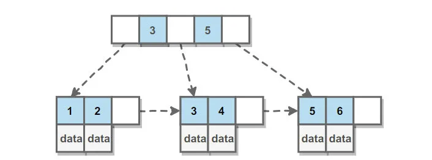
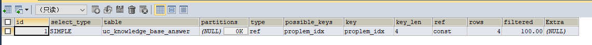

索引是在存储引擎层实现的，而不是在服务器上实现的，所以不同的存储引擎具有不用的索引类型和实现。

## 索引的作用

- 提高索引速度
- 确保数据的一致性
- 可以加速表和表之间的连接、实现表与表之间的参照完整性
- 使用分组和排序字句进行数据检索时，可以显著减少分组和排序的时间

## 分类

### B+树索引

它是mysql大多存储引擎的默认索引类型。

- 因为不再需要进行全局扫描，只需要对树的进行搜索即可，所以查找速度快很多
- 因为B +Tree的有序性，所以除了用于查找，还可以用于排序和分组
- 可以指定多个列作为索引列，多个索引列共同组成键
- 适用于全键值，键值范围和键前缀查找，其中键前缀查找只适用于最左前缀查找。如果不是按照索引列的顺序列的顺序进行查找，则无法适用索引。

INNODB的B+ 树索引分为主索引和辅助索引。主索引的叶子节点data域记录着完整的数据记录，这种索引方式被称为聚簇索引。因为无法吧数据存在两个不同的地方，索引一张表只能有一个聚簇索引。

辅助索引的叶子节点的data域记录着主键的值，因此在使用辅助索引进行查找时，需要先找到主键值，然后再到主索引中进行查找，这个过程也称之为回表。

### 主键索引

主键：某一个属性可以唯一的标识一条记录

特点：

- 最常见的索引类型
- 确保数据记录的唯一性
- 确定特定数据记录在数据库中的位置

### 哈希索引

哈希索引能以O(1)时间进行查找，但是失去了有序性。

- 无法用于排序和分组。
- 只支持精确查找，无法用于部分查找和范围查找。

InnoDB 存储引擎有一个特殊的功能叫“自适应哈希索引”，当某个索引值被使用的非常频繁时，会在 B+Tree 索引之上再创建一个哈希索引，这样就让 B+Tree 索引具有哈希索引的一些优点，比如快速的哈希查找。

### 空间数据索引

MyISAM 存储引擎支持空间数据索引（R-Tree），可以用于地理数据存储。空间数据索引会从所有维度来索引数据，可以有效地使用任意维度来进行组合查询。

必须使用 GIS 相关的函数来维护数据。

### 唯一索引

作用：避免用一个表中某数据列中的值重复

与主键索引的区别：主键索引只能有一个，唯一索引可以有多个

### 常规索引

作用：快速定位特定数据

注意：

- index与key关键字都可以设置常规索引
- 应加在查询找条件的字段
- 不宜添加太多常规索引，会影响数据的插入、删除和修改操作

```sql
CREATE TABLE `result`(
   -- 省略一些代码
  INDEX/KEY `ind` (`studentNo`,`subjectNo`) -- 创建表时添加  ind是索引名
)

-- 创建后添加
ALTER TABLE `result` ADD INDEX `ind`(`studentNo`,`subjectNo`);
```

### 全文索引

作用：快速定位特定数据，用于查找文本中的关键字，而不是直接比较是否相同

注意：

- 只能用于MyIsAm类型的数据表
- 只能用于char、varchar、text数据列类型
- 适合大型数据库
- 查找条件使用 MATCH AGAINST，而不是普通的 WHERE。
- 全文索引使用倒排索引实现，它记录着关键词到其所在文档的映射。
- InnoDB 存储引擎在 MySQL 5.6.4 版本中也开始支持全文索引。

## 创建方式

```sql
/*
#方法一：创建表时
  　　CREATE TABLE 表名 (
               字段名1 数据类型 [完整性约束条件…],
               字段名2 数据类型 [完整性约束条件…],
               [UNIQUE | FULLTEXT | SPATIAL ]   INDEX | KEY
               [索引名] (字段名[(长度)] [ASC |DESC])
               );


#方法二：CREATE在已存在的表上创建索引
       CREATE [UNIQUE | FULLTEXT | SPATIAL ] INDEX 索引名
                    ON 表名 (字段名[(长度)] [ASC |DESC]) ;


#方法三：ALTER TABLE在已存在的表上创建索引
       ALTER TABLE 表名 ADD [UNIQUE | FULLTEXT | SPATIAL ] INDEX
                            索引名 (字段名[(长度)] [ASC |DESC]) ;
                           
                           
#删除索引：DROP INDEX 索引名 ON 表名字;
#删除主键索引: ALTER TABLE 表名 DROP PRIMARY KEY;


#显示索引信息: SHOW INDEX FROM student;
*/

/* 增加全文索引 */
ALTER TABLE `school`.`student` ADD FULLTEXT INDEX `studentname` (`StudentName`);

/*EXPLAIN : 分析SQL语句执行性能*/
EXPLAIN SELECT * FROM student WHERE studentno='1000';

/* 使用全文索引 */
-- 全文搜索通过 MATCH() 函数完成。
-- 搜索字符串作为 against() 的参数被给定。搜索以忽略字母大小写的方式执行。对于表中的每个记录行，MATCH() 返回一个相关性值。即，在搜索字符串与记录行在 MATCH() 列表中指定的列的文本之间的相似性尺度。

EXPLAIN SELECT *FROM student WHERE MATCH(studentname) AGAINST('love');

/*
开始之前，先说一下全文索引的版本、存储引擎、数据类型的支持情况

MySQL 5.6 以前的版本，只有 MyISAM 存储引擎支持全文索引；
MySQL 5.6 及以后的版本，MyISAM 和 InnoDB 存储引擎均支持全文索引;
只有字段的数据类型为 char、varchar、text 及其系列才可以建全文索引。
测试或使用全文索引时，要先看一下自己的 MySQL 版本、存储引擎和数据类型是否支持全文索引。
*/
```

```sql
create [unique|cluster] index 索引名 on 表名(列名[ASC|AESC])
create [单一索引|聚簇索引] index 索引名 on 表名(列名[升序|降序])
```

## 索引准则

- 索引不是越多越好
- 不要经常变动数据加索引
- 小数据量的表建议不加索引
- 索引一般应加在查找条件的字段

## 索引的数据结构

**我们可以在创建上述索引的时候，为其指定索引类型，分两类**

- hash类型的索引：查询单条快，范围查询慢
- b tree类型的索引：b+树，层数越多，数据量指数级增长（我们就用它，因为innodb默认支持它）

**不同的存储引擎支持的索引类型也不一样**

- InnoDB 支持事务，支持行级别锁定，支持 B-tree、Full-text 等索引，不支持 Hash 索引；
- MyISAM 不支持事务，支持表级别锁定，支持 B-tree、Full-text 等索引，不支持 Hash 索引；
- Memory 不支持事务，支持表级别锁定，支持 B-tree、Hash 等索引，不支持 Full-text 索引；
- NDB 支持事务，支持行级别锁定，支持 Hash 索引，不支持 B-tree、Full-text 等索引；
- Archive 不支持事务，支持表级别锁定，不支持 B-tree、Hash、Full-text 等索引；

### B+ Tree原理

#### 数据结构

B Tree指的是平衡树（Balance Tree），平衡树是一种查找树，并且所有的叶子节点位于同一层

B+ Tree 是B树一种变形，它是基于B Tree 和叶子节点顺序访问指针进行实现，通常用于数据库和操作系统的文件系统中。

B+树有两种类型的节点：内部节点（也称索引节点）和叶子节点，内部节点就是非叶子节点，内部节点不存储数据，只存储索引，数据都存在叶子节点中。

内部节点的key都是按照从小到大的顺序排列，对于内部节点中的一个key，左子树中的所有key都小于它，右子树中所有key都大于它，叶子节点中记录也是按照从小到大的顺序排列的。

每个叶子节点都存在相邻叶子节点的引用


#### 树的常见特性

##### AVL 树

平衡二叉树，一般是用平衡因子差值决定并通过旋转来实现，左右子树树高差不超过1，那么和红黑树比较它是严格的平衡二叉树，平衡条件非常严格（树高差只有1），只要插入或删除不满足上面的条件就要通过旋转来保持平衡。由于旋转是非常耗费时间的。所以 AVL 树适用于插入/删除次数比较少，但查找多的场景。

##### 红黑树

通过对从根节点到叶子节点路径上各个节点的颜色进行约束，确保没有一条路径会比其他路径长2倍，因而是近似平衡的。所以相对于严格要求平衡的AVL树来说，它的旋转保持平衡次数较少。适合，查找少，插入/删除次数多的场景。（现在部分场景使用跳表来替换红黑树，可搜索“为啥 redis 使用跳表(skiplist)而不是使用 red-black？”）

##### B/B+树

多路查找树，出度高，磁盘IO低，一般用于数据库系统中。

##### B+树和红黑树的比较

红黑树等平衡树可以用来实现索引，但是文件系统及数据库系统普遍采用B+ Tree作为索引结构，主要有以下两个原因：

- 磁盘IO次数

  B+树一个节点可以存储多个元素，相对于红黑树的树高更低，磁盘IO次数更少

- 磁盘预读特性

  为了减少磁盘I/O操作，磁盘往往不是严格按需读取，而是每次都会预读。预读过程中，磁盘进行顺序读取，顺序读取不需要进行磁盘寻道。每次会读取页的整倍数。

  操作系统一般将内存和磁盘分割成固定大小的块，每一块称为一页，内存与磁盘以页为单位交换数据。数据库系统将索引的一个节点的大小设置为页的大小，使得一次 I/O 就能完全载入一个节点。

##### B+树和B树的比较

B + 树的磁盘IO更低

B+树的内部节点并没有指向关键字具体信息的指针。因此其内部节点相对B树更小。如果把所有同一内部节点的关键字存放在同一盘块中，那么盘块所能容纳的关键字数量也就越多。一次性读入内存中的需要查找的关键字也就越多。相对来说IO读写次数也就降低了。

B+树的查询效率更加稳定

由于非叶子结点并不是最终指向文件内容的结点，而只是叶子结点中关键字的索引。所以任何关键字的查找必须走一条从根结点到叶子结点的路。所有关键字查询的路径长度相同，导致每一个数据的查询效率相当。

B+树元素遍历效率高

B 树在提高了磁盘IO性能的同时并没有解决元素遍历的效率低下的问题。正是为了解决这个问题，B+树应运而生。B+树只要遍历叶子节点就可以实现整棵树的遍历。而且在数据库中基于范围的查询是非常频繁的，而 B 树不支持这样的操作（或者说效率太低）。


# 创建索引的注意点

1. **创建索引**

　      对于查询占主要的应用来说，索引显得尤为重要。很多时候性能问题很简单的就是因为我们忘了添加索引而造成的，或者说没有添加更为有效的索引导致。如果不加

　      索引的话，那么查找任何哪怕只是一条特定的数据都会进行一次全表扫描，如果一张表的数据量很大而符合条件的结果又很少，那么不加索引会引起致命的性能下降。
但是也不是什么情况都非得建索引不可，比如性别可能就只有两个值，建索引不仅没什么优势，还会影响到更新速度，这被称为过度索引。

2. **复合索引**

　      比如有一条语句是这样的：

``` sql
select * from users where area=’beijing’ and age=22;
```

​    如果我们是在area和age上分别创建单个索引的话，由于mysql查询每次只能使用一个索引，所以虽然这样已经相对不做索引时全表扫描提高了很多效率，但是如果在area、age两列上创建复合索引的话将带来更高的效率。如果我们创建了(area, age,salary)的复合索引，那么其实相当于创建了(area,age,salary)、(area,age)、(area)三个索引，这被称为最佳左前缀特性。
​    因此我们在创建复合索引时应该将最常用作限制条件的列放在最左边，依次递减。**(最左匹配原则)**

3. **索引不会包含有NULL值的列**

​    只要列中包含有NULL值都将不会被包含在索引中，复合索引中只要有一列含有NULL值，那么这一列对于此复合索引就是无效的。所以我们在数据库设计时不要让字段的默认值为NULL。

4. **使用短索引**

​    对串列进行索引，如果可能应该指定一个前缀长度。例如，如果有一个CHAR(255)的 列，如果在前10 个或20 个字符内，多数值是惟一的，那么就不要对整个列进行索引。短索引不仅可以提高查询速度而且可以节省磁盘空间和I/O操作。

5. **排序的索引问题**

​    mysql查询只使用一个索引，因此如果where子句中已经使用了索引的话，那么order by中的列是不会使用索引的。因此数据库默认排序可以符合要求的情况下不要使用排序操作；尽量不要包含多个列的排序，如果需要最好给这些列创建复合索引。

6. **like语句操作**

​    一般情况下不鼓励使用like操作，如果非使用不可，如何使用也是一个问题。like “%aaa%” 不会使用索引而like “aaa%”可以使用索引。

7. **不要在列上进行运算**

```sql
select * from users where YEAR(adddate);
```

8. **不使用NOT IN**

​    NOT IN都不会使用索引将进行全表扫描。NOT IN可以NOT EXISTS代替


# 对Explain解读

**【示例】**

```sql
EXPLAIN SELECT * FROM `t8t_mid_uc`.`uc_knowledge_base_answer` WHERE problem_id = 1;
```

**【结果】**


**【解读】**

**【id】**

​    id列的编号是 select 的序列号，有几个 select 就有几个id，并且id的顺序是按 select 出现的顺序增长的。
​    id列越大执行优先级越高，id相同则从上往下执行，id为NULL最后执行。
**【其他示例】**

```sql
EXPLAIN SELECT * FROM 
`t8t_mid_uc`.`uc_knowledge_base_answer` 
WHERE problem_id IN(
	SELECT id FROM `t8t_mid_uc`.`uc_knowledge_base_problem` 
	WHERE problem LIKE '%水电%');
```

**【结果】**


**【select_type】**

- simple：简单查询、查询不包括子查询和union
- primary：复杂查询中的最外层select
- subquery：包含在select中的子查询（不再from语句中）
- derived：包含在from 子句中的子查询。MySQL会将结果存放在一个临时表中，也称之为派生表（dervied的中意）
- union：在union 中的第二个和随后的select
  补充union操作符
  **【union语法】**

```sql
SELECT column_name(s) FROM table_name1
UNION
SELECT column_name(s) FROM table_name2
```

​    默认union 操作符选取不同的值，如果允许相同的值，需要使用union all
UNION 结果集中的列名总是等于 UNION 中第一个 SELECT 语句中的列名。

**【table】**

​	explain的一行正在访问哪个表
​    当from子句中有子查询时，table列是\<derivenN\>格式，表示当前查询依赖 id=N 的查询，于是先执行 id=N 的查询。
当有 union 时，UNION RESULT 的 table 列的值为\<union1,2\>，1和2表示参与 union 的 select 行id。
**【type】**

​    表示关联类型或访问类型，即mysql决定如何查找表中的数据，查找数据行记录的大概范围
​    最优到最差依次是：

```tex
system > const > eq_ref > ref > range > index_merge > index > ALL
```

​    通常来说，得保证查询到range级别、最好达到ref

- null：mysql能够在优化阶段分解查询语句，在执行阶段用不着再访问表或索引。例如：在索引列中选取最小值，可以单独查找索引来完成，不需要在执行时访问表
- const,system：mysql能对查询的某部分进行优化并将其转化成一个常量（可以看show warnings 的结果）。用于 primary key 或 unique key 的所有列与常数比较时，所以表最多有一个匹配行，读取1次，速度比较快。system是const的特例，表里只有一条元组匹配时为system
- eq_ref：primary key 或 unique key 索引的所有部分被连接使用 ，最多只会返回一条符合条件的记录。这可能是在 const 之外最好的联接类型了，简单的 select 查询不会出现这种 type。
- ref：相比 eq_ref，不使用唯一索引，而是使用普通索引或者唯一性索引的部分前缀，索引要和某个值相比较，可能会找到多个符合条件的行。

1. 简单 select 查询，name是普通索引（非唯一索引）
2. 关联表查询，idx_film_actor_id是film_id和actor_id的联合索引，这里使用到了film_actor的左边前缀film_id部分。
       - range：范围扫描通常出现在 in(), between ,> ,<, >= 等操作中。使用一个索引来检索给定范围的行。
       - merge_index：表示查询使用了两个以上的索引，最后取交集或者并集，常见and ，or的条件使用了不同的索引
       - index：扫描全表索引，这通常比ALL快一些。
       - ALL：即全表扫描，意味着mysql需要从头到尾去查找所需要的行。通常情况下这需要增加索引来进行优化了

**【possible_keys】**

​    显示查询可能使用哪些索引来查找。 
​    explain 时可能出现 possible_keys 有列，而 key 显示 NULL 的情况，这种情况是因为表中	数据	不多，mysql认为索引对此查询帮助不大，选择了全表查询。 
如果该列是NULL，则没有相关的索引。在这种情况下，可以通过检查 where 子句看是否可以创造一个适当的索引来提高查询性能，然后用 explain 查看效果。

**【key】**

​    显示mysql实际采用哪个索引来优化对该表的访问。
如果没有使用索引，则该列是 NULL。如果想强制mysql使用或忽视possible_keys列中的索引，在查询中使用 force index、ignore index。

**【key_len】**

​    显示了mysql在索引里使用的字节数，通过这个值可以算出具体使用了索引中的哪些列。 
举例来说，film_actor的联合索引 idx_film_actor_id 由 film_id 和 actor_id 两个int列组成，并且每个int是4字节。通过结果中的key_len=4可推断出查询使用了第一个列：film_id列来执行索引查找。

**key_len计算规则如下：**

字符串

​    - char(n)：n字节长度
​    - varchar(n)：2字节存储字符串长度，如果是utf-8，则长度 3n + 2

数值类型
    - tinyint：1字节
    - smallint：2字节
    - int：4字节
    - bigint：8字节　　

时间类型　
    - date：3字节
    - timestamp：4字节
    - datetime：8字节

​    如果字段允许为 NULL，需要1字节记录是否为 NULL
​    索引最大长度是768字节，当字符串过长时，mysql会做一个类似左前缀索引的处理，将前半部分的字符提取出来做索引。

**【ref】**

​    显示了在key列记录的索引中，表查找值所用到的列或常量，常见的有：const（常量），字段名（例：film.id）

**【rows】**
    mysql估计要读取并检测的行数，注意这个不是结果集里的行数。

**【Extar】**

​    展示的是额外信息。常见的重要值如下： 

​    1）Using index：使用覆盖索引

覆盖索引定义：mysql执行计划explain结果里的key有使用索引，如果select后面查询的字段都可以从这个索引的树中获取，这种情况一般可以说是用到了覆盖索引，extra里一般都有using index；覆盖索引一般针对的是辅助索引，整个查询结果只通过辅助索引就能拿到结果，不需要通过辅助索引树找到主键，再通过主键去主键索引树里获取其它字段值

​    2）Using where：使用 where 语句来处理结果，并且查询的列未被索引覆盖，5.6.x之后支持ICP特性，可以把检查条件也下推到存储引擎层，不符合检查条件和限制条件的数据，直接不读取，extra列显示using index condition

​    3）Using index condition：查询的列不完全被索引覆盖，where条件中是一个前导列的范围查询；（所谓前导列，就是在创建复合索引语句的第一列或者连续的多列。比如通过：CREATE INDEX film ON table1(x, y, z)创建索引，那么x，xy，xyz都是前导列，而yz，y，z这样的就不是）

​    4）Using temporary：mysql需要创建一张临时表来处理查询。出现这种情况一般是要进行优化的，首先是想到用索引来优化。

​        1. actor.name没有索引，此时创建了张临时表来distinct
​        2. film.name建立了idx_name索引，此时查询时extra是using index,没有用临时表
​    5）Using filesort：将用外部排序而不是索引排序，数据较小时从内存排序，否则需要在磁盘完成排序。这种情况下一般也是要考虑使用索引来优化的。

​        1. actor.name未创建索引，会浏览actor整个表，保存排序关键字name和对应的id，然后排序name并检索行记录
​        2. film.name建立了idx_name索引,此时查询时extra是using index

​    6）Select tables optimized away：使用某些聚合函数（比如 max、min）来访问存在索引的某个字段时