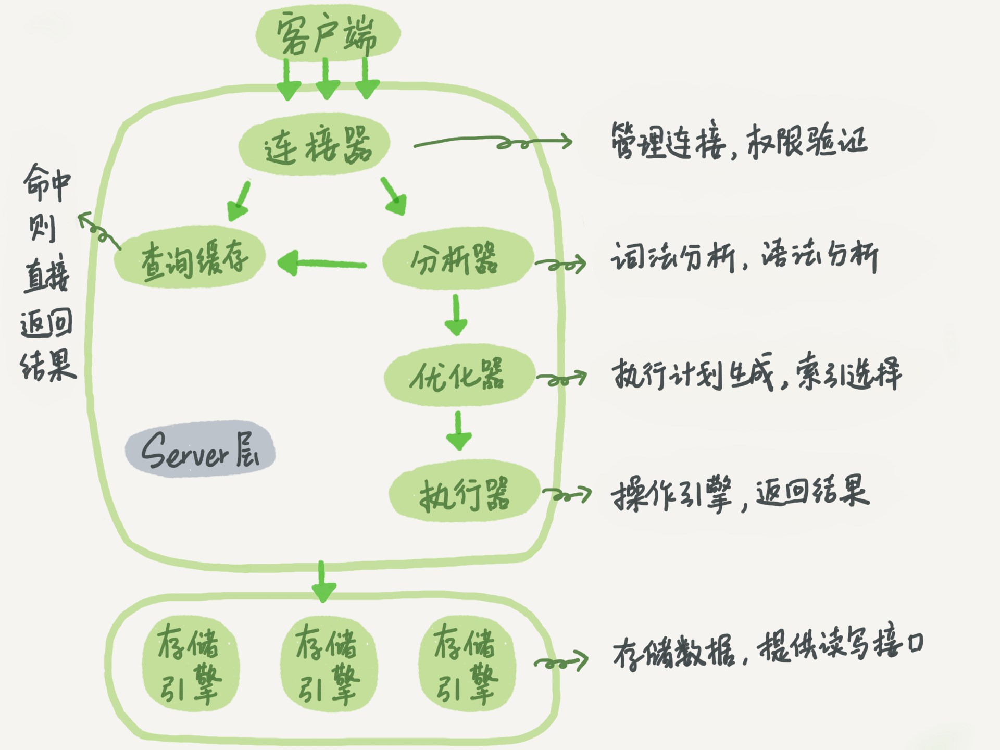

<Toc />

# Mysql的简易架构图

# 范式

关系型数据库中的关系是要满足一定要求的，满足不同程度要求的为不同范式（关系型数据中的每一张表是符合一范式）

第一范式：每个属性（字段）不可再分

存在问题：插入异常、删除异常、修改复杂、数据冗余

第二范式：每个属性都完全依赖于一个候选码

存在问题：删除异常、插入异常

第三范式：符合第二范式的前提且不存在传递依赖

存在问题：查询困难
