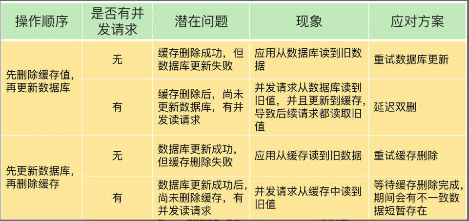

# Redis 的异常
实际应用Redis缓存时，会经常遇到一些异常问题，总共能够分为四个方面：
1. 缓存中数据与数据库中的数据不一致
2. 缓存雪崩
3. 缓存击穿
4. 缓存穿透

## 缓存中的数据与数据库的数据一致性问题
Redis缓存根据是否有写请求分为两类：读写缓存、只读缓存

### 对于读写缓存的一致性问题：
对于重要数据，一般采用同步直写策略，即在写入数据库的同时也写入缓存，需要注意的是，采用这种策略应该在应用中使用事务机制，来保证缓存和数据库的更新具有原子性。
不重要的数据（对数据一致性的要求低）使用异步写回策略就好了，即只写入数据库就好了，当缓存过期的时候再自动等待更新就好。

### 对于只读缓存来说
数据库新增数据是对缓存没有影响的，因为缓存中本来就没有这个新增数据。
所以下面只讨论**删改数据**的情况：
删改数据的情况下，不管我们是先对数据库操作在对缓存操作，还是先对缓存操作再对数据库操作，只要有一个或多个操作失败就会导致缓存系统的一致性问题。
应对措施：

## 缓存雪崩
缓存雪崩既是指很多业务请求在缓冲中无法获取到缓存数据而导致大量请求打到数据库中，最终导致数据库增压甚至宕机等。
发生缓存雪崩的原因有：**大量key再同一时间过期、单机Redis实例宕机等**
应对措施：
1. 不同的key在设置规定的过期时间的时候额外加个随机的额外过期时间，这样就不会导致大量缓存数据在同一时刻过期。
2. 使用Redis集群+哨兵机制，保证单台Redis宕机后，可以选举出新的leader来提供缓存服务
3. 服务降级：即让部分服务不可用，不可用缓存使用预定义兜底信息、null值或返回报错。
4. 服务熔断：直接舍弃缓存服务，但是也不请求到数据库，直接给出报错。
5. 请求限流：统计请求次数，限制单位时间内的请求次数，超过的直接给出报错。

## 缓存击穿
缓存击穿是指热点数据在过期的回复缓存的一瞬间有大量并发请求过来导致全都查询数据库，导致数据库压力骤增
应对措施：
1. 热点数据不设置过期时间

## 缓存穿透
缓存穿透是指是指有请求是请求缓存中不存在数据库中也不存在的数据，这种情况会给缓存服务和数据库都会带来压力
发生场景：**业务不小心误删除、恶意攻击、新功能还没有配置登**
应对措施：
1. 针对查询的数据，在Redis缓存中设置一个空值或者缺省值。
2. 使用布隆过滤器快速判断数据是否存在，避免从数据库中查询数据是否存在，减轻数据库压力
3. 请求入口的前端进行请求检测。缓存穿透的一个原因是有大量的恶意请求访问不存在的数据，所以，一个有效的应对方案是在请求入口前端，对业务系统接收到的请求进行合法性检测，把恶意的请求（例如请求参数不合理、请求参数是非法值、请求字段不存在）直接过滤掉，不让它们访问后端缓存和数据库。这样一来，也就不会出现缓存穿透问题了。